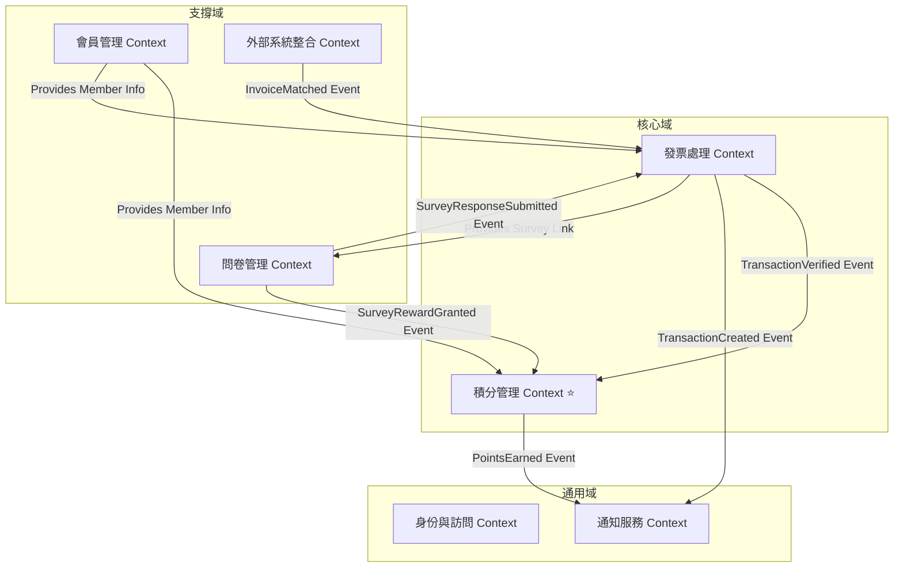
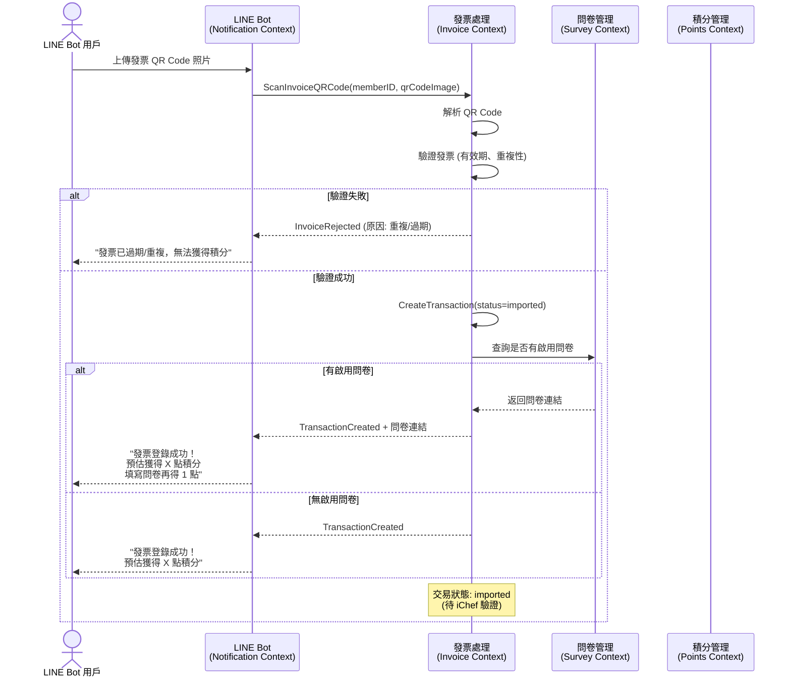
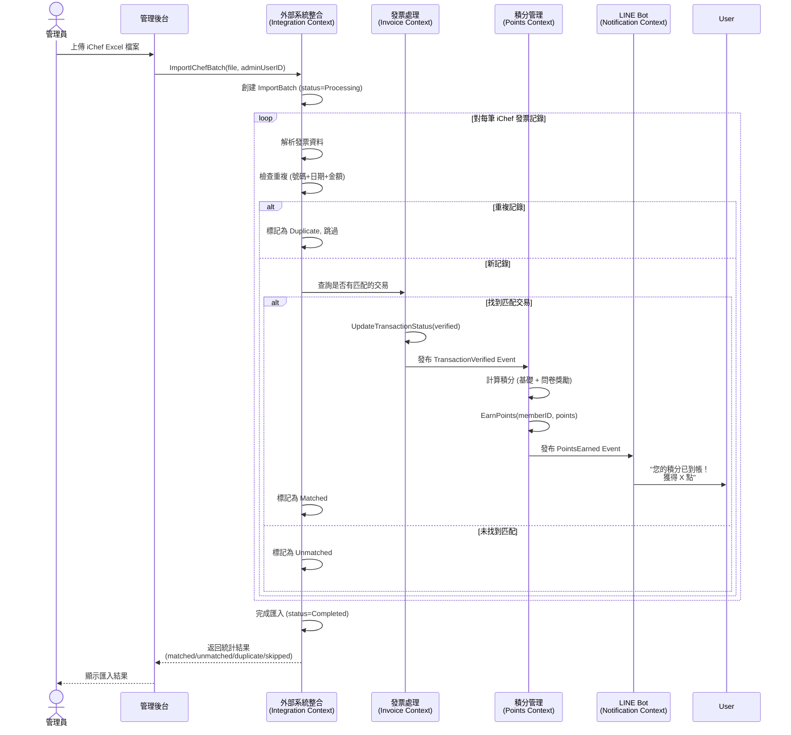
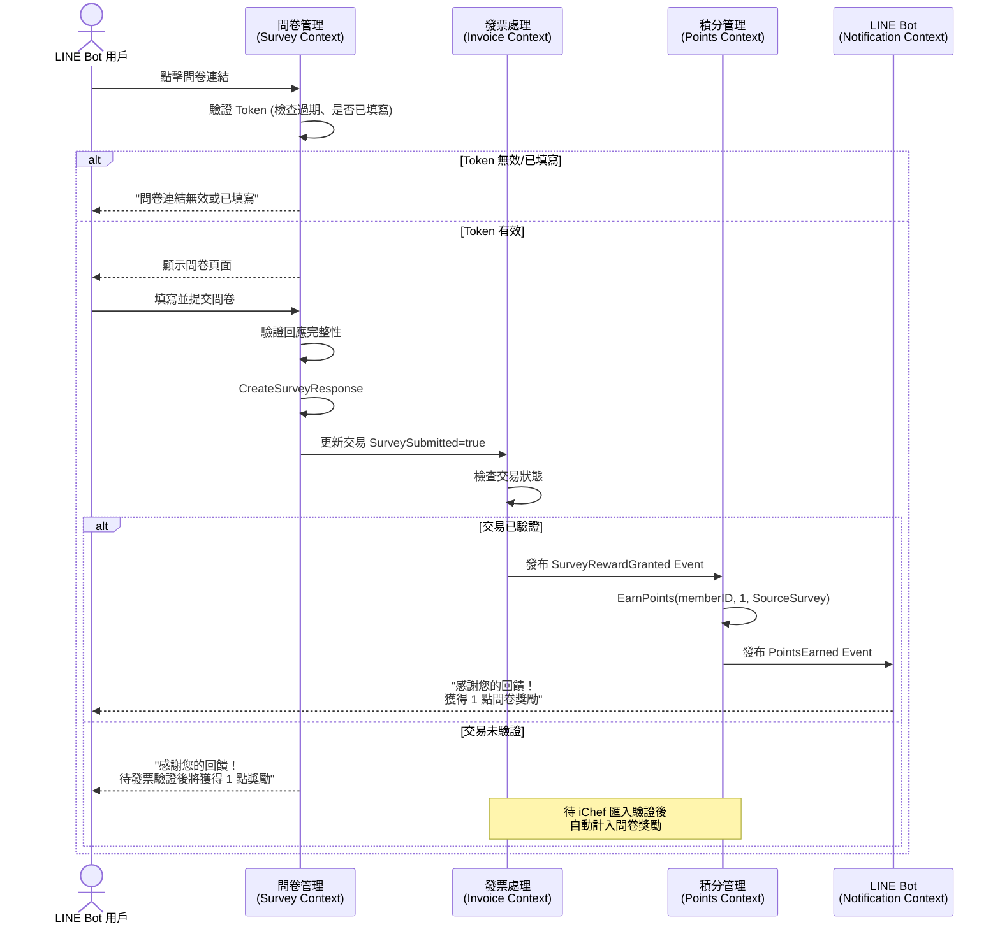
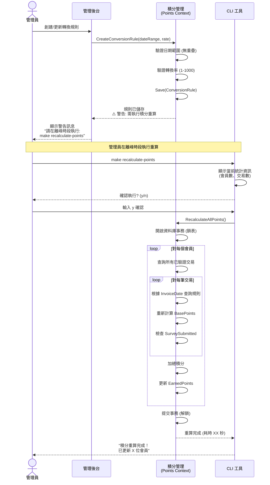

# **Domain-Driven Design 架構設計指南**

> **版本**: 1.0
> **最後更新**: 2025-01-08
> **設計原則**: 基於 DDD 戰略設計，中粒度限界上下文，核心域為積分管理

---

## **目錄**

1. [設計概述](#1-設計概述)
2. [戰略設計 (Strategic Design)](#2-戰略設計-strategic-design)
3. [限界上下文劃分](#3-限界上下文劃分)
4. [上下文映射圖 (Context Map)](#4-上下文映射圖-context-map)
5. [戰術設計 (Tactical Design)](#5-戰術設計-tactical-design)
6. [關鍵業務流程](#6-關鍵業務流程)
7. [分層架構設計](#7-分層架構設計)
8. [未來擴展考量](#8-未來擴展考量)

---

## **1. 設計概述**

### **1.1 設計目標**

本文檔提供餐廳會員管理 LINE Bot 系統的 Domain-Driven Design (DDD) 架構設計，目標是：

- **清晰的業務邊界**: 透過限界上下文劃分，建立清晰的業務能力邊界
- **核心域聚焦**: 識別積分管理為核心域，集中資源進行設計與優化
- **未來擴展性**: 考慮 V3.2+ 的積分兌換、優惠券等功能的架構彈性
- **技術實現指引**: 提供從領域概念到技術實現的清晰映射

### **1.2 設計原則**

- **限界上下文粒度**: 中粒度，根據業務能力劃分，平衡內聚性與獨立性
- **事件驅動**: 使用領域事件實現上下文間的鬆耦合集成
- **不變性保護**: 透過聚合根保護業務不變性規則
- **充血模型**: 領域邏輯封裝在領域對象內，而非分散在服務層

### **1.3 領域劃分策略**

基於 PRD 分析，本系統劃分為：

| 類型 | 上下文 | 業務價值 | 投資優先級 |
|------|--------|----------|-----------|
| **核心域** | 積分管理 | 核心競爭力，差異化業務邏輯 | 最高 ⭐⭐⭐ |
| **核心域** | 發票處理 | 關鍵業務流程，影響用戶體驗 | 高 ⭐⭐ |
| **支撐域** | 會員管理 | 支撐核心業務，標準化流程 | 中 ⭐ |
| **支撐域** | 問卷管理 | 增強用戶參與度 | 中 ⭐ |
| **支撐域** | 外部系統整合 | 資料驗證與同步 | 中 ⭐ |
| **通用域** | 身份與訪問 | 通用功能，可採用現成方案 | 低 |
| **通用域** | 通知服務 | 通用功能，LINE SDK 處理 | 低 |

---

## **2. 戰略設計 (Strategic Design)**

### **2.1 領域事件識別**

透過 Event Storming 方法，識別系統中的關鍵領域事件：

#### **會員管理領域事件**
- `MemberRegistered` - 會員已註冊
- `PhoneNumberBound` - 手機號碼已綁定
- `MemberProfileUpdated` - 會員資料已更新

#### **積分管理領域事件** (核心域 ⭐)
- `PointsEarned` - 積分已獲得 (交易驗證或問卷完成)
- `PointsDeducted` - 積分已扣除 (V3.2+ 兌換)
- `PointsExpired` - 積分已過期 (V3.3+)
- `PointsTransferred` - 積分已轉讓 (V4.0+)
- `ConversionRuleCreated` - 轉換規則已創建
- `ConversionRuleUpdated` - 轉換規則已更新
- `ConversionRuleDeleted` - 轉換規則已刪除
- `PointsRecalculationRequested` - 積分重算已請求
- `PointsRecalculated` - 積分已重算

#### **發票處理領域事件**
- `InvoiceQRCodeScanned` - 發票 QR Code 已掃描
- `InvoiceParsed` - 發票已解析
- `InvoiceValidated` - 發票已驗證 (通過所有驗證規則)
- `InvoiceRejected` - 發票已拒絕 (重複/過期/無效)
- `TransactionCreated` - 交易已創建 (狀態: imported)
- `TransactionVerified` - 交易已驗證 (狀態: verified)
- `TransactionFailed` - 交易已失敗 (狀態: failed)
- `InvoiceVoided` - 發票已作廢

#### **外部系統整合領域事件**
- `BatchImportStarted` - 批次匯入已開始
- `BatchImportCompleted` - 批次匯入已完成
- `InvoiceMatched` - 發票已匹配 (iChef 與會員掃描記錄)
- `InvoiceUnmatched` - 發票未匹配

#### **問卷管理領域事件**
- `SurveyCreated` - 問卷已創建
- `SurveyActivated` - 問卷已啟用
- `SurveyDeactivated` - 問卷已停用
- `SurveyResponseSubmitted` - 問卷回應已提交
- `SurveyRewardGranted` - 問卷獎勵已發放

### **2.2 命令識別**

| 上下文 | 命令 | 觸發者 | 產生事件 |
|--------|------|--------|----------|
| 會員管理 | `RegisterMember` | LINE Bot 用戶 | `MemberRegistered` |
| 會員管理 | `BindPhoneNumber` | LINE Bot 用戶 | `PhoneNumberBound` |
| 積分管理 | `EarnPoints` | 系統 | `PointsEarned` |
| 積分管理 | `RedeemPoints` | LINE Bot 用戶 | `PointsDeducted` |
| 積分管理 | `CreateConversionRule` | 管理員 | `ConversionRuleCreated` |
| 積分管理 | `RecalculateAllPoints` | 管理員 | `PointsRecalculated` |
| 發票處理 | `ScanInvoiceQRCode` | LINE Bot 用戶 | `InvoiceQRCodeScanned`, `TransactionCreated` |
| 發票處理 | `VerifyTransaction` | 系統 | `TransactionVerified` |
| 外部系統整合 | `ImportIChefBatch` | 管理員 | `BatchImportStarted`, `InvoiceMatched` |
| 問卷管理 | `SubmitSurveyResponse` | LINE Bot 用戶 | `SurveyResponseSubmitted`, `SurveyRewardGranted` |

### **2.3 業務不變性規則**

#### **會員管理**
- 每個 LINE 帳號只能綁定一個手機號碼
- 每個手機號碼只能綁定一個 LINE 帳號
- 手機號碼格式必須為 10 位數字，09 開頭

#### **積分管理** (核心業務規則 ⭐)
- 積分計算公式: `基礎積分 = floor(消費金額 / 轉換率)`
- 問卷獎勵: 每筆交易完成問卷額外 +1 點
- 累積積分 = Σ(所有已驗證交易的基礎積分 + 問卷獎勵)
- 轉換率日期範圍不可重疊
- 轉換率必須在 1-1000 之間
- 積分不可為負數
- 只有已驗證交易才計入累積積分

#### **發票處理**
- 發票有效期: 開立日期起 60 天內
- 同一發票號碼只能登錄一次 (唯一性約束)
- 發票必須通過解析才能創建交易
- 交易狀態流轉: `imported` → `verified` 或 `failed`

#### **問卷管理**
- 同一時間只能有一個啟用的問卷
- 同一筆交易的問卷只能填寫一次
- 問卷獎勵只有在交易驗證後才計入積分

---

## **3. 限界上下文劃分**

### **3.1 上下文概覽**

本系統劃分為 **7 個限界上下文**，遵循中粒度原則：

```
┌─────────────────────────────────────────────────────────┐
│                     餐廳會員管理系統                        │
├─────────────────────────────────────────────────────────┤
│                                                         │
│  ┌─────────────┐  ┌──────────────┐  ┌──────────────┐  │
│  │  會員管理    │  │  積分管理 ⭐  │  │  發票處理     │  │
│  │  (支撐域)    │  │  (核心域)    │  │  (核心域)     │  │
│  └─────────────┘  └──────────────┘  └──────────────┘  │
│                                                         │
│  ┌─────────────┐  ┌──────────────┐  ┌──────────────┐  │
│  │  問卷管理    │  │  外部系統整合 │  │  身份與訪問   │  │
│  │  (支撐域)    │  │  (支撐域)    │  │  (通用域)     │  │
│  └─────────────┘  └──────────────┘  └──────────────┘  │
│                                                         │
│  ┌─────────────┐                                       │
│  │  通知服務    │                                       │
│  │  (通用域)    │                                       │
│  └─────────────┘                                       │
│                                                         │
└─────────────────────────────────────────────────────────┘
```

---

### **3.2 會員管理上下文 (Member Management Context)**

**領域類型**: 支撐域
**職責**: 管理會員註冊、手機號碼綁定、基本資料維護

#### **統一語言 (Ubiquitous Language)**
- **會員 (Member)**: 已完成註冊並綁定手機號碼的 LINE 用戶
- **LINE 用戶 ID**: LINE Platform 分配的唯一識別碼
- **手機號碼綁定**: 將 LINE 帳號與台灣手機號碼關聯的過程
- **註冊狀態**: 會員的註冊完成狀態 (已註冊/未註冊)

#### **聚合設計**

**聚合: Member** (聚合根)
```
Member (Aggregate Root)
├── MemberID (Entity ID - Value Object)
├── LineUserID (Value Object) - 唯一
├── DisplayName (Value Object)
├── PhoneNumber (Value Object) - 唯一
├── RegistrationDate (Value Object)
└── IsActive (Value Object)
```

**值對象**:
- `MemberID`: UUID 格式的會員識別碼
- `LineUserID`: LINE Platform 的用戶 ID (以 "U" 開頭)
- `PhoneNumber`: 台灣手機號碼 (10 位數，09 開頭)
- `DisplayName`: LINE 用戶的顯示名稱

#### **聚合方法（接口定義）**

**Member 聚合根方法**:
```go
// 構造方法
NewMember(lineUserID LineUserID, displayName DisplayName) (*Member, error)

// 命令方法
BindPhoneNumber(phoneNumber PhoneNumber) error
  // 前置條件: phoneNumber 已通過唯一性檢查
  // 後置條件: PhoneNumber 已綁定，IsActive = true
  // 不變性保護: 每個 Member 只能綁定一個 PhoneNumber

UpdateDisplayName(displayName DisplayName) error
  // 更新顯示名稱

Deactivate() error
  // 停用會員帳號
  // 後置條件: IsActive = false

// 查詢方法
IsRegistered() bool
  // 返回: PhoneNumber 是否已綁定

GetLineUserID() LineUserID
GetPhoneNumber() PhoneNumber
GetDisplayName() DisplayName
```

#### **領域服務**
- `MemberRegistrationService`: 處理會員註冊流程，驗證手機號碼唯一性
- `PhoneNumberBindingService`: 處理手機號碼綁定邏輯

#### **倉儲接口**

**MemberRepository** (會員聚合持久化接口):
```go
// 創建操作
Create(member *Member) error
  // 插入新會員
  // 返回: ErrMemberAlreadyExists 如果 LineUserID 重複

// 更新操作
Update(member *Member) error
  // 更新現有會員
  // 返回: ErrMemberNotFound 如果會員不存在

// 查詢操作
FindByID(memberID MemberID) (*Member, error)
  // 返回: ErrMemberNotFound 如果不存在

FindByLineUserID(lineUserID LineUserID) (*Member, error)
  // 返回: ErrMemberNotFound 如果不存在

FindByPhoneNumber(phoneNumber PhoneNumber) (*Member, error)
  // 返回: ErrMemberNotFound 如果不存在

// 存在性檢查
ExistsByLineUserID(lineUserID LineUserID) (bool, error)
ExistsByPhoneNumber(phoneNumber PhoneNumber) (bool, error)
  // 用於註冊前檢查唯一性

// 刪除操作
Delete(memberID MemberID) error
  // 軟刪除: IsActive = false
  // 返回: ErrMemberNotFound 如果不存在
```

#### **領域事件**
- `MemberRegistered`: 會員完成註冊
- `PhoneNumberBound`: 手機號碼綁定成功
- `MemberProfileUpdated`: 會員資料更新

#### **領域錯誤定義**

```go
// 會員管理上下文錯誤
var (
    ErrMemberNotFound           error = "Member not found"
    ErrMemberAlreadyExists      error = "Member with this LineUserID already exists"
    ErrPhoneNumberAlreadyBound  error = "This phone number is already bound to another member"
    ErrInvalidPhoneNumberFormat error = "Phone number must be 10 digits starting with 09"
    ErrInvalidLineUserID        error = "LineUserID must start with 'U'"
    ErrMemberNotRegistered      error = "Member has not completed registration"
    ErrMemberDeactivated        error = "Member account is deactivated"
)
```

---

### **3.3 積分管理上下文 (Points Management Context)** ⭐

**領域類型**: 核心域
**職責**: 管理積分賺取、查詢、使用、轉換規則、積分重算

#### **統一語言 (Ubiquitous Language)**
- **積分帳戶 (Points Account)**: 會員的積分錢包，記錄累積積分與可用積分
- **累積積分 (Earned Points)**: 會員所有已驗證交易獲得的積分總和
- **可用積分 (Available Points)**: 累積積分 - 已使用積分
- **轉換率 (Conversion Rate)**: 消費金額轉換為積分的比率 (例: 100 元 = 1 點)
- **轉換規則 (Conversion Rule)**: 定義特定日期範圍內的轉換率
- **基礎積分 (Base Points)**: 根據消費金額與轉換率計算的積分
- **問卷獎勵積分 (Survey Bonus Points)**: 完成問卷獲得的額外積分 (+1 點)
- **積分交易 (Points Transaction)**: 積分變動記錄 (賺取/扣除)

#### **聚合設計**

**聚合 1: PointsAccount** (聚合根)
```
PointsAccount (Aggregate Root)
├── AccountID (Entity ID - Value Object)
├── MemberID (Reference to Member Context)
├── EarnedPoints (Value Object) - 累積積分
├── UsedPoints (Value Object) - 已使用積分
├── AvailablePoints (Computed) - 可用積分
├── LastUpdatedAt (Value Object)
└── PointsTransactions (Entity Collection)
    └── PointsTransaction (Entity)
        ├── TransactionID
        ├── Type (Earned/Deducted)
        ├── Amount
        ├── Source (Invoice/Survey/Redemption)
        ├── SourceID (Reference)
        ├── CreatedAt
        └── Description
```

**聚合 2: ConversionRule** (聚合根)
```
ConversionRule (Aggregate Root)
├── RuleID (Entity ID - Value Object)
├── DateRange (Value Object)
│   ├── StartDate
│   └── EndDate
├── ConversionRate (Value Object) - 轉換率 (1-1000)
├── IsActive (Value Object)
├── CreatedAt (Value Object)
└── UpdatedAt (Value Object)
```

**值對象**:
- `PointsAmount`: 積分數量，必須 >= 0
- `ConversionRate`: 轉換率，範圍 1-1000
- `DateRange`: 日期範圍，StartDate <= EndDate，不可與其他規則重疊
- `PointsTransactionType`: 枚舉 (Earned, Deducted)
- `PointsSource`: 枚舉 (Invoice, Survey, Redemption, Expiration, Transfer)

#### **聚合方法（接口定義）**

**PointsAccount 聚合根方法**:
```go
// 構造方法
NewPointsAccount(memberID MemberID) (*PointsAccount, error)
  // 初始狀態: EarnedPoints=0, UsedPoints=0

// 命令方法（狀態變更）
EarnPoints(amount PointsAmount, source PointsSource, sourceID string, description string) error
  // 增加積分
  // 前置條件: amount > 0
  // 後置條件: EarnedPoints += amount, 創建 PointsTransaction 記錄
  // 不變性保護: 積分不可為負數

DeductPoints(amount PointsAmount, reason string) error
  // 扣除積分（V3.2+ 兌換功能）
  // 前置條件: amount > 0
  // 前置條件: AvailablePoints >= amount
  // 後置條件: UsedPoints += amount, 創建 PointsTransaction 記錄
  // 不變性保護: 可用積分不可為負數
  // 返回: ErrInsufficientPoints 如果餘額不足

RecalculateEarnedPoints(verifiedTransactions []VerifiedTransaction) error
  // 重新計算累積積分（管理員觸發）
  // 參數: 所有已驗證交易的列表（包含 Amount, InvoiceDate, SurveySubmitted）
  // 邏輯:
  //   1. 對每筆交易查詢適用的 ConversionRule
  //   2. 計算 BasePoints = floor(Amount / ConversionRate)
  //   3. 計算 SurveyBonus = SurveySubmitted ? 1 : 0
  //   4. TotalPoints = Σ(BasePoints + SurveyBonus)
  // 後置條件: EarnedPoints = TotalPoints
  // 注意: 此操作必須在資料庫事務中執行（鎖表）

// 查詢方法
GetAvailablePoints() PointsAmount
  // 返回: EarnedPoints - UsedPoints

GetEarnedPoints() PointsAmount
GetUsedPoints() PointsAmount

GetTransactions() []PointsTransaction
  // 返回所有積分交易記錄

GetTransactionsBySource(source PointsSource) []PointsTransaction
  // 按來源篩選交易記錄
```

**ConversionRule 聚合根方法**:
```go
// 構造方法
NewConversionRule(dateRange DateRange, conversionRate ConversionRate) (*ConversionRule, error)
  // 前置條件: dateRange.StartDate <= dateRange.EndDate
  // 前置條件: conversionRate 在 1-1000 範圍內
  // 前置條件: dateRange 不與現有規則重疊（由 Domain Service 檢查）
  // 返回: ErrDateRangeOverlap, ErrInvalidConversionRate

// 命令方法
UpdateDateRange(newDateRange DateRange) error
  // 更新日期範圍
  // 前置條件: newDateRange 不與其他規則重疊（由 Domain Service 檢查）
  // 返回: ErrDateRangeOverlap

UpdateConversionRate(newRate ConversionRate) error
  // 更新轉換率
  // 前置條件: newRate 在 1-1000 範圍內
  // 返回: ErrInvalidConversionRate

Activate() error
  // 啟用規則

Deactivate() error
  // 停用規則

// 查詢方法
IsActiveForDate(date Date) bool
  // 檢查規則是否適用於指定日期
  // 返回: IsActive && (StartDate <= date <= EndDate)

GetDateRange() DateRange
GetConversionRate() ConversionRate
IsActive() bool
```

#### **領域服務（接口定義）**

**PointsCalculationService** (核心業務邏輯):
```go
CalculateBasePoints(amount Money, invoiceDate Date) (PointsAmount, error)
  // 計算基礎積分
  // 算法:
  //   1. 查詢 invoiceDate 適用的 ConversionRule
  //   2. BasePoints = floor(amount / conversionRate)
  // 返回: ErrNoConversionRuleForDate 如果找不到規則
  // 返回: ErrInvalidAmount 如果 amount <= 0

CalculateSurveyBonus(surveySubmitted bool) PointsAmount
  // 計算問卷獎勵
  // 返回: 1 如果 surveySubmitted=true, 否則 0

CalculateTotalPoints(basePoints PointsAmount, surveyBonus PointsAmount) PointsAmount
  // 計算總積分
  // 返回: basePoints + surveyBonus
```

**PointsRecalculationService** (積分重算服務):
```go
RecalculateAllAccounts(db Transaction) error
  // 重算所有會員的累積積分
  // 前置條件: 必須在資料庫事務中執行
  // 流程:
  //   1. 對每個會員查詢所有已驗證交易
  //   2. 對每筆交易重新計算積分（根據 InvoiceDate 查詢規則）
  //   3. 更新 PointsAccount.EarnedPoints
  // 性能: 鎖表 30-60 秒
  // 返回: 錯誤時回滾整個事務

RecalculateMemberAccount(memberID MemberID, db Transaction) error
  // 重算單一會員的累積積分
  // 前置條件: 必須在資料庫事務中執行
  // 流程: 同上，僅針對單一會員
```

**ConversionRuleValidationService** (轉換規則驗證服務):
```go
ValidateRuleDateRange(dateRange DateRange, excludeRuleID RuleID) error
  // 驗證日期範圍不與現有規則重疊
  // 參數 excludeRuleID: 更新時排除自身
  // 返回: ErrDateRangeOverlap 如果有重疊
  // 返回: ErrInvalidDateRange 如果 StartDate > EndDate

ValidateConversionRate(rate ConversionRate) error
  // 驗證轉換率在 1-1000 範圍內
  // 返回: ErrInvalidConversionRate

GetRuleForDate(date Date) (*ConversionRule, error)
  // 查詢指定日期適用的轉換規則
  // 返回: ErrNoConversionRuleForDate 如果找不到
```

#### **倉儲接口**

**PointsAccountRepository**:
```go
// 創建操作
Create(account *PointsAccount) error
  // 為新會員創建積分帳戶
  // 返回: ErrAccountAlreadyExists 如果帳戶已存在

// 更新操作
Update(account *PointsAccount) error
  // 更新積分帳戶（包含所有 PointsTransaction）
  // 返回: ErrAccountNotFound 如果帳戶不存在

// 查詢操作
FindByID(accountID AccountID) (*PointsAccount, error)
  // 返回: ErrAccountNotFound 如果不存在

FindByMemberID(memberID MemberID) (*PointsAccount, error)
  // 返回: ErrAccountNotFound 如果不存在
  // 注意: 包含所有 PointsTransaction 實體集合

// 批次操作
FindAll() ([]*PointsAccount, error)
  // 查詢所有積分帳戶（重算時使用）
  // 注意: 不包含 PointsTransaction 集合（性能考量）

// 事務操作
UpdateInTransaction(account *PointsAccount, db Transaction) error
  // 在資料庫事務中更新（重算時使用）
  // 前置條件: db 必須是活躍的資料庫事務
```

**ConversionRuleRepository**:
```go
// 創建操作
Create(rule *ConversionRule) error
  // 創建新規則
  // 返回: ErrRuleAlreadyExists 如果規則已存在

// 更新操作
Update(rule *ConversionRule) error
  // 更新現有規則
  // 返回: ErrRuleNotFound 如果規則不存在

// 查詢操作
FindByID(ruleID RuleID) (*ConversionRule, error)
  // 返回: ErrRuleNotFound 如果不存在

FindByDate(date Date) (*ConversionRule, error)
  // 查詢指定日期適用的規則
  // 條件: IsActive=true AND StartDate <= date <= EndDate
  // 返回: ErrNoConversionRuleForDate 如果找不到

FindOverlapping(dateRange DateRange, excludeRuleID RuleID) ([]*ConversionRule, error)
  // 查詢與指定日期範圍重疊的規則（用於驗證）
  // 參數 excludeRuleID: 更新時排除自身（傳 nil 表示不排除）
  // 返回: 重疊的規則列表（可能為空）

FindAll() ([]*ConversionRule, error)
  // 查詢所有規則（管理後台使用）

FindActive() ([]*ConversionRule, error)
  // 查詢所有啟用的規則

// 刪除操作
Delete(ruleID RuleID) error
  // 刪除規則
  // 返回: ErrRuleNotFound 如果規則不存在
  // 注意: 刪除後需手動執行積分重算
```

#### **領域事件**
- `PointsEarned`: 積分已獲得 (交易驗證或問卷完成)
- `PointsDeducted`: 積分已扣除 (V3.2+ 兌換)
- `ConversionRuleCreated`: 轉換規則已創建
- `ConversionRuleUpdated`: 轉換規則已更新
- `ConversionRuleDeleted`: 轉換規則已刪除
- `PointsRecalculationRequested`: 積分重算已請求 (管理員觸發)
- `PointsRecalculated`: 積分已重算 (系統完成)

#### **領域錯誤定義**

```go
// 積分管理上下文錯誤（核心域 ⭐）
var (
    // PointsAccount 相關錯誤
    ErrAccountNotFound         error = "Points account not found"
    ErrAccountAlreadyExists    error = "Points account already exists for this member"
    ErrInsufficientPoints      error = "Insufficient points for this operation"
    ErrNegativePointsAmount    error = "Points amount cannot be negative"
    ErrInvalidPointsSource     error = "Invalid points source"

    // ConversionRule 相關錯誤
    ErrRuleNotFound             error = "Conversion rule not found"
    ErrRuleAlreadyExists        error = "Conversion rule already exists"
    ErrNoConversionRuleForDate  error = "No conversion rule found for the specified date"
    ErrDateRangeOverlap         error = "Date range overlaps with existing conversion rule"
    ErrInvalidDateRange         error = "Invalid date range: start date must be before or equal to end date"
    ErrInvalidConversionRate    error = "Conversion rate must be between 1 and 1000"

    // 積分計算相關錯誤
    ErrInvalidAmount            error = "Amount must be greater than 0"
    ErrRecalculationFailed      error = "Points recalculation failed"
    ErrRecalculationInProgress  error = "Points recalculation is already in progress"
)
```

---

### **3.4 發票處理上下文 (Invoice Processing Context)**

**領域類型**: 核心域
**職責**: 處理發票掃描、解析、驗證、交易記錄管理

#### **統一語言 (Ubiquitous Language)**
- **發票 (Invoice)**: 台灣電子發票，包含發票號碼、日期、金額
- **QR Code 掃描 (QR Code Scan)**: 用戶上傳發票 QR Code 照片的過程
- **發票驗證 (Invoice Validation)**: 檢查發票有效期、重複性、格式
- **交易 (Transaction)**: 會員掃描發票後創建的消費記錄
- **交易狀態**: imported (待驗證) / verified (已驗證) / failed (已失敗)
- **發票號碼**: 10 位英數字組合
- **發票日期**: 發票開立日期 (ROC 民國年格式: yyyMMdd)
- **有效期**: 發票開立日期起 60 天內

#### **聚合設計**

**聚合: InvoiceTransaction** (聚合根)
```
InvoiceTransaction (Aggregate Root)
├── TransactionID (Entity ID - Value Object)
├── MemberID (Reference to Member Context)
├── Invoice (Value Object)
│   ├── InvoiceNumber (Value Object) - 唯一
│   ├── InvoiceDate (Value Object)
│   ├── Amount (Money Value Object)
│   └── TaxID (Value Object - optional)
├── Status (Value Object) - imported/verified/failed
├── QRCodeData (Value Object)
├── SurveySubmitted (Value Object) - boolean
├── SurveyID (Reference to Survey Context - optional)
├── VerifiedAt (Value Object - optional)
├── CreatedAt (Value Object)
└── UpdatedAt (Value Object)
```

**值對象**:
- `InvoiceNumber`: 10 位英數字，格式驗證
- `InvoiceDate`: 日期，格式 yyyMMdd (ROC 年份)
- `Money`: 金額，必須 > 0
- `TransactionStatus`: 枚舉 (Imported, Verified, Failed)
- `QRCodeData`: 發票 QR Code 原始資料

#### **聚合方法（接口定義）**

**InvoiceTransaction 聚合根方法**:
```go
// 構造方法
NewInvoiceTransaction(memberID MemberID, invoice Invoice, qrCodeData QRCodeData) (*InvoiceTransaction, error)
  // 創建新交易（初始狀態: imported）
  // 前置條件: invoice 已通過驗證（有效期、格式）
  // 前置條件: invoice.InvoiceNumber 唯一性已檢查
  // 後置條件: Status = Imported, CreatedAt = 現在時間

// 命令方法（狀態變更）
VerifyTransaction(verifiedAt time.Time) error
  // 驗證交易（iChef 匹配成功）
  // 前置條件: Status == Imported
  // 後置條件: Status = Verified, VerifiedAt = 指定時間
  // 副作用: 發布 TransactionVerified 事件 → 觸發積分計算
  // 返回: ErrInvalidStatusTransition 如果當前狀態不是 Imported

FailTransaction(reason string) error
  // 標記交易為失敗
  // 前置條件: Status == Imported
  // 後置條件: Status = Failed
  // 返回: ErrInvalidStatusTransition 如果當前狀態不是 Imported

LinkSurvey(surveyID SurveyID) error
  // 關聯問卷到交易
  // 前置條件: SurveyID 存在且啟用
  // 後置條件: SurveyID 已設置

MarkSurveySubmitted() error
  // 標記問卷已提交
  // 前置條件: SurveyID 不為 nil
  // 後置條件: SurveySubmitted = true
  // 副作用: 如果 Status == Verified，發布 SurveyRewardGranted 事件 → 觸發積分重算
  // 返回: ErrSurveyNotLinked 如果 SurveyID 為 nil

VoidInvoice(reason string) error
  // 作廢發票（V3.2+）
  // 前置條件: Status == Verified
  // 後置條件: Status = Failed
  // 副作用: 需要扣回已獲得的積分

// 查詢方法
GetInvoice() Invoice
GetStatus() TransactionStatus
GetMemberID() MemberID
IsSurveySubmitted() bool
IsVerified() bool
  // 返回: Status == Verified

CanVerify() bool
  // 返回: Status == Imported

GetSurveyID() (SurveyID, bool)
  // 返回: SurveyID 和是否存在
```

**InvoiceParsingService** (發票解析服務):
```go
ParseQRCode(qrCodeData string) (*Invoice, error)
  // 解析台灣電子發票 QR Code
  // QR Code 格式: 發票號碼(10碼)|日期(7碼 yyyMMdd)|金額|...
  // 返回: ErrInvalidQRCodeFormat 如果格式錯誤
  // 返回: ErrInvoiceParsingFailed 如果解析失敗

ExtractInvoiceNumber(qrCodeData string) (InvoiceNumber, error)
ExtractInvoiceDate(qrCodeData string) (InvoiceDate, error)
ExtractAmount(qrCodeData string) (Money, error)
```

**InvoiceValidationService** (發票驗證服務):
```go
ValidateInvoice(invoice Invoice) error
  // 綜合驗證發票
  // 檢查: 格式、有效期、重複性
  // 返回: ErrInvoiceDuplicate, ErrInvoiceExpired, ErrInvalidInvoiceFormat

CheckDuplicate(invoiceNumber InvoiceNumber) (bool, error)
  // 檢查發票號碼是否已存在
  // 返回: true 如果重複

CheckExpiry(invoiceDate InvoiceDate) bool
  // 檢查發票是否在有效期內（60 天）
  // 返回: true 如果已過期

ValidateInvoiceNumber(invoiceNumber InvoiceNumber) error
  // 驗證發票號碼格式（10 位英數字）
  // 返回: ErrInvalidInvoiceNumber

ValidateInvoiceDate(invoiceDate InvoiceDate) error
  // 驗證發票日期格式（yyyMMdd）
  // 返回: ErrInvalidInvoiceDate
```

**TransactionVerificationService** (交易驗證服務):
```go
VerifyTransaction(transactionID TransactionID) error
  // 驗證交易（iChef 匹配後調用）
  // 流程:
  //   1. 查詢交易
  //   2. 檢查狀態是否為 Imported
  //   3. 調用 transaction.VerifyTransaction()
  //   4. 保存交易
  //   5. 發布 TransactionVerified 事件
  // 返回: ErrTransactionNotFound, ErrInvalidStatusTransition
```

#### **倉儲接口**

**InvoiceTransactionRepository**:
```go
// 創建操作
Create(transaction *InvoiceTransaction) error
  // 創建新交易
  // 返回: ErrTransactionAlreadyExists, ErrInvoiceDuplicate

// 更新操作
Update(transaction *InvoiceTransaction) error
  // 更新現有交易
  // 返回: ErrTransactionNotFound

// 查詢操作
FindByID(transactionID TransactionID) (*InvoiceTransaction, error)
  // 返回: ErrTransactionNotFound

FindByInvoiceNumber(invoiceNumber InvoiceNumber) (*InvoiceTransaction, error)
  // 根據發票號碼查詢
  // 返回: ErrTransactionNotFound

FindByMemberID(memberID MemberID) ([]*InvoiceTransaction, error)
  // 查詢會員的所有交易

FindVerifiedByMemberID(memberID MemberID) ([]*InvoiceTransaction, error)
  // 查詢會員的已驗證交易（用於積分重算）
  // 條件: Status == Verified

FindByStatus(status TransactionStatus) ([]*InvoiceTransaction, error)
  // 按狀態查詢交易

// 存在性檢查
ExistsByInvoiceNumber(invoiceNumber InvoiceNumber) (bool, error)
  // 檢查發票號碼是否已存在（用於重複性檢查）

// 批次操作
FindByInvoiceNumbers(invoiceNumbers []InvoiceNumber) ([]*InvoiceTransaction, error)
  // 批次查詢交易（iChef 匹配時使用）
```

#### **領域事件**
- `InvoiceQRCodeScanned`: 發票 QR Code 已掃描
- `InvoiceParsed`: 發票已解析
- `InvoiceValidated`: 發票已驗證
- `InvoiceRejected`: 發票已拒絕 (重複/過期/無效)
- `TransactionCreated`: 交易已創建
- `TransactionVerified`: 交易已驗證
- `TransactionFailed`: 交易已失敗
- `InvoiceVoided`: 發票已作廢

#### **領域錯誤定義**

```go
// 發票處理上下文錯誤（核心域）
var (
    // Transaction 相關錯誤
    ErrTransactionNotFound          error = "Transaction not found"
    ErrTransactionAlreadyExists     error = "Transaction already exists"
    ErrInvalidStatusTransition      error = "Invalid transaction status transition"

    // Invoice 相關錯誤
    ErrInvoiceDuplicate            error = "Invoice with this number already exists"
    ErrInvoiceExpired              error = "Invoice has expired (older than 60 days)"
    ErrInvalidInvoiceNumber        error = "Invalid invoice number format (must be 10 alphanumeric characters)"
    ErrInvalidInvoiceDate          error = "Invalid invoice date format (must be yyyMMdd in ROC calendar)"
    ErrInvalidInvoiceFormat        error = "Invalid invoice format"
    ErrInvalidAmount               error = "Amount must be greater than 0"

    // QR Code 相關錯誤
    ErrInvalidQRCodeFormat         error = "Invalid QR code format"
    ErrQRCodeParsingFailed         error = "Failed to parse QR code data"

    // Survey 相關錯誤
    ErrSurveyNotLinked             error = "Survey is not linked to this transaction"
    ErrSurveyAlreadySubmitted      error = "Survey has already been submitted for this transaction"
    ErrInvalidSurveyID             error = "Invalid survey ID"

    // Verification 相關錯誤
    ErrCannotVerifyTransaction     error = "Cannot verify transaction: status must be 'imported'"
    ErrCannotVoidTransaction       error = "Cannot void transaction: status must be 'verified'"
)
```

---

### **3.5 外部系統整合上下文 (External Integration Context)**

**領域類型**: 支撐域
**職責**: 管理 iChef POS 系統批次匯入、發票匹配、資料同步

#### **統一語言 (Ubiquitous Language)**
- **批次匯入 (Batch Import)**: 從 iChef POS 系統匯入發票資料的過程
- **發票匹配 (Invoice Matching)**: 將 iChef 發票與會員掃描記錄配對
- **匹配條件**: 發票號碼、日期、金額三者完全一致
- **匯入狀態**: 處理中 (Processing) / 已完成 (Completed) / 失敗 (Failed)
- **匹配結果**: 已匹配 (Matched) / 未匹配 (Unmatched) / 跳過 (Skipped) / 重複 (Duplicate)

#### **聚合設計**

**聚合: ImportBatch** (聚合根)
```
ImportBatch (Aggregate Root)
├── BatchID (Entity ID - Value Object)
├── FileName (Value Object)
├── ImportedBy (AdminUserID Reference)
├── Status (Value Object) - Processing/Completed/Failed
├── Statistics (Value Object)
│   ├── TotalRows
│   ├── MatchedCount
│   ├── UnmatchedCount
│   ├── SkippedCount
│   └── DuplicateCount
├── InvoiceRecords (Entity Collection)
│   └── ImportedInvoiceRecord (Entity)
│       ├── RecordID
│       ├── InvoiceNumber
│       ├── InvoiceDate
│       ├── Amount
│       ├── MatchStatus (Matched/Unmatched/Skipped)
│       ├── MatchedTransactionID (optional)
│       └── CreatedAt
├── StartedAt (Value Object)
├── CompletedAt (Value Object - optional)
└── ErrorMessage (Value Object - optional)
```

**值對象**:
- `ImportStatistics`: 匯入統計資訊
- `MatchStatus`: 枚舉 (Matched, Unmatched, Skipped, Duplicate)
- `ImportStatus`: 枚舉 (Processing, Completed, Failed)

#### **領域服務**
- `IChefImportService`: iChef 匯入邏輯
  - `ImportExcelFile(file io.Reader, adminUserID AdminUserID) (*ImportBatch, error)`
- `InvoiceMatchingService`: 發票匹配邏輯
  - `MatchInvoice(invoiceRecord ImportedInvoiceRecord) (TransactionID, bool, error)`
- `DuplicateDetectionService`: 重複檢測邏輯
  - `IsDuplicate(invoiceNumber, date, amount) bool`

#### **倉儲接口**
- `ImportBatchRepository`:
  - `FindByID(batchID BatchID) (*ImportBatch, error)`
  - `Save(batch *ImportBatch) error`
  - `FindByDateRange(startDate, endDate Date) ([]*ImportBatch, error)`

#### **領域事件**
- `BatchImportStarted`: 批次匯入已開始
- `BatchImportCompleted`: 批次匯入已完成
- `InvoiceMatched`: 發票已匹配 (觸發交易驗證)
- `InvoiceUnmatched`: 發票未匹配

---

### **3.6 問卷管理上下文 (Survey Management Context)**

**領域類型**: 支撐域
**職責**: 管理問卷設計、回應收集、獎勵機制

#### **統一語言 (Ubiquitous Language)**
- **問卷 (Survey)**: 餐廳滿意度調查表
- **問題 (Question)**: 問卷中的單一問題
- **問題類型**: 文字題 (Text) / 選擇題 (MultipleChoice) / 評分題 (Rating)
- **問卷回應 (Survey Response)**: 會員填寫問卷的答案集合
- **啟用狀態**: 同時只能有一個問卷處於啟用狀態
- **問卷獎勵**: 完成問卷獲得 +1 點積分

#### **聚合設計**

**聚合 1: Survey** (聚合根)
```
Survey (Aggregate Root)
├── SurveyID (Entity ID - Value Object)
├── Title (Value Object)
├── Description (Value Object)
├── IsActive (Value Object)
├── Questions (Entity Collection)
│   └── SurveyQuestion (Entity)
│       ├── QuestionID
│       ├── QuestionText
│       ├── QuestionType (Text/MultipleChoice/Rating)
│       ├── IsRequired
│       ├── DisplayOrder
│       └── Options (for MultipleChoice)
├── CreatedAt (Value Object)
└── UpdatedAt (Value Object)
```

**聚合 2: SurveyResponse** (聚合根)
```
SurveyResponse (Aggregate Root)
├── ResponseID (Entity ID - Value Object)
├── SurveyID (Reference)
├── TransactionID (Reference to Invoice Context)
├── MemberID (Reference to Member Context)
├── Answers (Entity Collection)
│   └── Answer (Entity)
│       ├── AnswerID
│       ├── QuestionID (Reference)
│       ├── AnswerText
│       └── SelectedOptions
├── SubmittedAt (Value Object)
└── RewardGranted (Value Object) - boolean
```

**值對象**:
- `QuestionType`: 枚舉 (Text, MultipleChoice, Rating)
- `RatingScore`: 1-5 星評分

#### **領域服務**
- `SurveyActivationService`: 問卷啟用邏輯 (確保單一啟用)
- `SurveyResponseValidationService`: 驗證回應完整性
- `SurveyRewardService`: 發放問卷獎勵

#### **倉儲接口**
- `SurveyRepository`:
  - `FindActiveSurvey() (*Survey, error)`
  - `Save(survey *Survey) error`
- `SurveyResponseRepository`:
  - `FindByTransactionID(transactionID TransactionID) (*SurveyResponse, error)`
  - `Save(response *SurveyResponse) error`
  - `ExistsByTransactionID(transactionID TransactionID) bool`

#### **領域事件**
- `SurveyCreated`: 問卷已創建
- `SurveyActivated`: 問卷已啟用
- `SurveyDeactivated`: 問卷已停用
- `SurveyResponseSubmitted`: 問卷回應已提交
- `SurveyRewardGranted`: 問卷獎勵已發放 (觸發積分增加)

---

### **3.7 身份與訪問上下文 (Identity & Access Context)**

**領域類型**: 通用域
**職責**: 管理後台認證、授權、RBAC

#### **統一語言 (Ubiquitous Language)**
- **管理員 (Admin User)**: 使用管理後台的用戶
- **角色 (Role)**: Admin / User / Guest
- **權限 (Permission)**: 對特定資源的操作權限
- **訪問令牌 (Access Token)**: JWT 令牌

#### **聚合設計**

**聚合: AdminUser** (聚合根)
```
AdminUser (Aggregate Root)
├── UserID (Entity ID - Value Object)
├── Email (Value Object) - 唯一
├── Name (Value Object)
├── Role (Value Object) - Admin/User/Guest
├── IsActive (Value Object)
├── LastLoginAt (Value Object)
├── CreatedAt (Value Object)
└── UpdatedAt (Value Object)
```

---

### **3.8 通知服務上下文 (Notification Context)**

**領域類型**: 通用域
**職責**: LINE Bot 訊息推送、Webhook 處理

#### **統一語言 (Ubiquitous Language)**
- **通知 (Notification)**: 系統主動推送給用戶的訊息
- **Webhook 事件**: LINE Platform 推送的事件
- **訊息模板 (Message Template)**: 預定義的訊息格式

#### **聚合設計**

**聚合: Notification** (聚合根)
```
Notification (Aggregate Root)
├── NotificationID (Entity ID)
├── MemberID (Reference)
├── Type (Welcome/PointsEarned/SurveyLink/etc.)
├── MessageContent (Value Object)
├── SentAt (Value Object)
└── Status (Pending/Sent/Failed)
```

---

## **4. 上下文映射圖 (Context Map)**

### **4.1 上下文關係概覽**



### **4.2 上下文關係詳細說明**

#### **關係 1: 發票處理 → 積分管理** (事件驅動)
- **關係類型**: Customer-Supplier (客戶-供應商)
- **集成方式**: Domain Events (領域事件)
- **防腐層 (ACL)**: 積分管理訂閱 `TransactionVerified` 事件
- **數據流向**:
  - 發票處理發布 `TransactionVerified` 事件
  - 積分管理接收事件，計算並增加積分
  - 事件包含: MemberID, Amount, InvoiceDate, SurveySubmitted

#### **關係 2: 問卷管理 → 積分管理** (事件驅動)
- **關係類型**: Customer-Supplier
- **集成方式**: Domain Events
- **數據流向**:
  - 問卷管理發布 `SurveyRewardGranted` 事件
  - 積分管理接收事件，增加問卷獎勵積分 (+1 點)

#### **關係 3: 外部系統整合 → 發票處理** (事件驅動)
- **關係類型**: Customer-Supplier
- **集成方式**: Domain Events + Shared Kernel (共享發票識別碼)
- **數據流向**:
  - 外部系統整合發布 `InvoiceMatched` 事件
  - 發票處理接收事件，驗證交易狀態

#### **關係 4: 會員管理 → 積分管理 / 發票處理** (共享內核)
- **關係類型**: Shared Kernel (共享 MemberID)
- **集成方式**: 共享 MemberID 值對象
- **說明**: MemberID 是跨上下文的共享概念，所有上下文都使用相同的 MemberID 格式

#### **關係 5: 發票處理 ⇄ 問卷管理** (雙向關聯)
- **關係類型**: Partnership (夥伴關係)
- **集成方式**:
  - 發票處理創建交易時生成問卷連結
  - 問卷管理提交回應時更新交易的 `SurveySubmitted` 狀態
- **防腐層**:
  - 發票處理: `SurveyLinkGenerator` (生成問卷連結)
  - 問卷管理: `TransactionUpdater` (更新交易狀態)

#### **關係 6: 積分管理 / 發票處理 → 通知服務** (事件驅動)
- **關係類型**: Conformist (遵奉者)
- **集成方式**: Domain Events
- **說明**: 通知服務被動接收事件，無反饋

---

## **5. 戰術設計 (Tactical Design)**

### **5.1 核心域深度設計 - 積分管理** ⭐

#### **5.1.1 積分計算完整流程**

```
┌─────────────────────────────────────────────────────────────┐
│            積分計算流程 (Points Calculation Flow)              │
└─────────────────────────────────────────────────────────────┘

1. 交易驗證觸發
   TransactionVerified Event
   ├── TransactionID
   ├── MemberID
   ├── Amount (消費金額)
   ├── InvoiceDate (發票日期)
   └── SurveySubmitted (是否完成問卷)

2. 查詢轉換規則
   ConversionRuleQueryService.GetRuleForDate(InvoiceDate)
   └── 返回: ConversionRule (轉換率)

3. 計算基礎積分
   BasePoints = floor(Amount / ConversionRate)
   例: 250 / 100 = 2 點

4. 計算問卷獎勵
   SurveyBonus = SurveySubmitted ? 1 : 0

5. 計算總積分
   TotalPoints = BasePoints + SurveyBonus
   例: 2 + 1 = 3 點

6. 更新積分帳戶
   PointsAccount.EarnPoints(TotalPoints, SourceInvoice, TransactionID)
   ├── EarnedPoints += TotalPoints
   └── 創建 PointsTransaction 記錄

7. 發布領域事件
   PointsEarned Event
   └── 觸發通知: "您獲得了 3 點積分"
```

#### **5.1.2 積分重算機制**

```
┌─────────────────────────────────────────────────────────────┐
│          積分重算流程 (Points Recalculation Flow)             │
└─────────────────────────────────────────────────────────────┘

觸發條件:
1. 管理員創建/更新/刪除轉換規則
2. 管理員手動執行重算指令

重算步驟:
1. 鎖定所有會員的積分帳戶 (Database Transaction)
2. 對每個會員:
   a. 查詢所有已驗證交易 (Status = Verified)
   b. 對每筆交易:
      - 根據 InvoiceDate 查詢適用的 ConversionRule
      - 重新計算 BasePoints
      - 檢查 SurveySubmitted, 計算 SurveyBonus
   c. 加總所有交易的積分
   d. 更新 EarnedPoints
3. 提交事務
4. 發布 PointsRecalculated 事件

注意事項:
- 重算期間鎖表 30-60 秒
- 必須在離峰時段執行
- 使用事務保證原子性
- 需要管理員確認才執行
```

#### **5.1.3 積分兌換擴展設計 (V3.2+)**

```
┌─────────────────────────────────────────────────────────────┐
│            未來: 積分兌換設計 (Points Redemption)              │
└─────────────────────────────────────────────────────────────┘

新增聚合: RedemptionCatalog (兌換目錄)
├── CatalogID
├── Items (Entity Collection)
│   └── RedemptionItem (Entity)
│       ├── ItemID
│       ├── Name
│       ├── PointsCost (兌換所需積分)
│       ├── StockQuantity (庫存)
│       ├── IsActive
│       └── ValidUntil
└── UpdatedAt

新增聚合: Redemption (兌換記錄)
├── RedemptionID
├── MemberID
├── ItemID
├── PointsDeducted (扣除積分)
├── Status (Pending/Confirmed/Cancelled)
├── RedeemedAt
└── CompletedAt

新增業務規則:
1. 可用積分 >= PointsCost 才能兌換
2. 兌換後立即扣除積分 (AvailablePoints -= PointsCost)
3. 兌換記錄可在 24 小時內取消
4. 取消後積分退回

新增領域事件:
- RedemptionRequested (兌換請求已提交)
- RedemptionConfirmed (兌換已確認)
- RedemptionCancelled (兌換已取消)
- PointsRefunded (積分已退回)
```

---

## **6. 關鍵業務流程**

### **6.1 業務流程 1: QR Code 掃描與積分獲得**



### **6.2 業務流程 2: iChef 批次匯入與交易驗證**



### **6.3 業務流程 3: 問卷填寫與獎勵發放**



### **6.4 業務流程 4: 積分規則變更與重算**



---

## **7. 分層架構設計**

### **7.1 六角架構 (Hexagonal Architecture)**

本系統採用六角架構 (又稱 Ports and Adapters)，確保領域邏輯獨立於技術實現：

```
┌──────────────────────────────────────────────────────────────┐
│                       Presentation Layer                       │
│                         (展示層)                                │
│  ┌──────────────┐  ┌──────────────┐  ┌──────────────┐       │
│  │  LINE Bot    │  │  Admin Web   │  │  REST API    │       │
│  │  Webhook     │  │  Frontend    │  │  Endpoints   │       │
│  └──────────────┘  └──────────────┘  └──────────────┘       │
│         ▲                  ▲                  ▲               │
│         │                  │                  │               │
│         └──────────────────┴──────────────────┘               │
│                            │                                  │
└────────────────────────────┼──────────────────────────────────┘
                             │
┌────────────────────────────┼──────────────────────────────────┐
│                       Application Layer                        │
│                         (應用層)                                │
│  ┌───────────────────────────────────────────────────────┐   │
│  │         Application Services (Use Cases)               │   │
│  │  ┌─────────────┐  ┌─────────────┐  ┌─────────────┐   │   │
│  │  │  Member     │  │  Points     │  │  Invoice    │   │   │
│  │  │  AppService │  │  AppService │  │  AppService │   │   │
│  │  └─────────────┘  └─────────────┘  └─────────────┘   │   │
│  └───────────────────────────────────────────────────────┘   │
│                            │                                  │
│  ┌───────────────────────────────────────────────────────┐   │
│  │            Command / Query Handlers                    │   │
│  │         (CQRS Pattern - 讀寫分離)                       │   │
│  └───────────────────────────────────────────────────────┘   │
│                            │                                  │
└────────────────────────────┼──────────────────────────────────┘
                             │
┌────────────────────────────┼──────────────────────────────────┐
│                        Domain Layer                            │
│                         (領域層)                                │
│  ┌───────────────────────────────────────────────────────┐   │
│  │                  Bounded Contexts                      │   │
│  │  ┌──────────┐  ┌──────────┐  ┌──────────┐            │   │
│  │  │  Member  │  │  Points  │  │  Invoice │  ...       │   │
│  │  │  Context │  │  Context │  │  Context │            │   │
│  │  └──────────┘  └──────────┘  └──────────┘            │   │
│  └───────────────────────────────────────────────────────┘   │
│                                                               │
│  ┌───────────────────────────────────────────────────────┐   │
│  │                Aggregates & Entities                   │   │
│  │  - Member, PointsAccount, InvoiceTransaction, ...     │   │
│  └───────────────────────────────────────────────────────┘   │
│                                                               │
│  ┌───────────────────────────────────────────────────────┐   │
│  │                  Value Objects                         │   │
│  │  - MemberID, PointsAmount, InvoiceNumber, ...         │   │
│  └───────────────────────────────────────────────────────┘   │
│                                                               │
│  ┌───────────────────────────────────────────────────────┐   │
│  │                Domain Services                         │   │
│  │  - PointsCalculationService                           │   │
│  │  - InvoiceValidationService                           │   │
│  └───────────────────────────────────────────────────────┘   │
│                                                               │
│  ┌───────────────────────────────────────────────────────┐   │
│  │               Repository Interfaces                    │   │
│  │  (Port - 由基礎設施層實現)                              │   │
│  └───────────────────────────────────────────────────────┘   │
│                            │                                  │
└────────────────────────────┼──────────────────────────────────┘
                             │
┌────────────────────────────┼──────────────────────────────────┐
│                   Infrastructure Layer                         │
│                      (基礎設施層)                               │
│  ┌───────────────────────────────────────────────────────┐   │
│  │              Repository Implementations                │   │
│  │  ┌─────────────┐  ┌─────────────┐  ┌─────────────┐   │   │
│  │  │  GORM       │  │  Redis      │  │  Mock       │   │   │
│  │  │  Repository │  │  Repository │  │  Repository │   │   │
│  │  └─────────────┘  └─────────────┘  └─────────────┘   │   │
│  └───────────────────────────────────────────────────────┘   │
│                                                               │
│  ┌───────────────────────────────────────────────────────┐   │
│  │               External Service Adapters                │   │
│  │  ┌─────────────┐  ┌─────────────┐  ┌─────────────┐   │   │
│  │  │  LINE SDK   │  │  Google     │  │  iChef API  │   │   │
│  │  │  Adapter    │  │  OAuth      │  │  Adapter    │   │   │
│  │  └─────────────┘  └─────────────┘  └─────────────┘   │   │
│  └───────────────────────────────────────────────────────┘   │
│                                                               │
│  ┌───────────────────────────────────────────────────────┐   │
│  │                 Event Bus / Message Queue              │   │
│  │         (未來可替換為 RabbitMQ/Kafka)                   │   │
│  └───────────────────────────────────────────────────────┘   │
│                                                               │
│  ┌───────────────────────────────────────────────────────┐   │
│  │                    Database                            │   │
│  │       PostgreSQL / SQLite (開發環境)                   │   │
│  └───────────────────────────────────────────────────────┘   │
└──────────────────────────────────────────────────────────────┘
```

### **7.2 層次職責定義**

#### **展示層 (Presentation Layer)**
- **職責**: 處理外部請求，轉換為應用層命令/查詢
- **組件**:
  - LINE Bot Webhook Handler
  - REST API Controllers
  - GraphQL Resolvers (未來)
- **原則**:
  - 不包含業務邏輯
  - 只負責協議轉換 (HTTP ↔ 應用服務)
  - 輸入驗證 (格式、型別)

#### **應用層 (Application Layer)**
- **職責**: 協調領域對象完成用例，管理事務
- **組件**:
  - Application Services (每個用例一個方法)
  - Command Handlers (處理寫入操作)
  - Query Handlers (處理讀取操作)
  - Event Handlers (訂閱領域事件)
- **原則**:
  - 薄薄一層，不包含業務規則
  - 編排領域對象和領域服務
  - 管理事務邊界
  - 發布領域事件到事件總線

#### **領域層 (Domain Layer)**
- **職責**: 封裝核心業務邏輯與規則
- **組件**:
  - Aggregates (聚合根)
  - Entities (實體)
  - Value Objects (值對象)
  - Domain Services (領域服務)
  - Repository Interfaces (倉儲接口)
  - Domain Events (領域事件)
- **原則**:
  - 純粹的業務邏輯，無基礎設施依賴
  - 使用統一語言 (Ubiquitous Language)
  - 聚合根保護不變性規則
  - 充血模型 (Rich Domain Model)

#### **基礎設施層 (Infrastructure Layer)**
- **職責**: 提供技術實現，支撐上層
- **組件**:
  - Repository Implementations (GORM, Redis)
  - External Service Adapters (LINE SDK, Google OAuth)
  - Event Bus / Message Queue
  - Database Migrations
  - Configuration Management
- **原則**:
  - 實現領域層定義的接口
  - 可替換性 (Pluggable)
  - 不洩漏到上層

---

## **8. 未來擴展考量**

### **8.1 V3.2: 積分兌換功能**

**影響的上下文**:
- 積分管理: 新增 `DeductPoints` 業務邏輯
- 新增上下文: 兌換管理 (Redemption Context)

**架構變更**:
```
新增聚合: RedemptionCatalog, Redemption
新增領域事件: PointsDeducted, RedemptionConfirmed
新增業務流程: 兌換申請 → 積分扣除 → 兌換確認
```

### **8.2 V3.3: 優惠券系統**

**影響的上下文**:
- 新增上下文: 優惠券管理 (Coupon Context)
- 發票處理: 新增優惠券核銷邏輯

**架構變更**:
```
新增聚合: Coupon, CouponUsage
新增上下文關係: 發票處理 → 優惠券管理 (事件驅動)
```

### **8.3 V3.4: 會員等級制度**

**影響的上下文**:
- 會員管理: 新增會員等級邏輯
- 積分管理: 等級影響積分轉換率

**架構變更**:
```
會員管理新增: MemberTier (Value Object)
積分管理調整: 計算積分時考慮會員等級加成
```

### **8.4 技術演進路線圖**

#### **階段 1: 單體應用 (當前)**
- 所有上下文在同一進程
- 共享資料庫
- 異步事件總線

#### **階段 2: 模組化單體**
- 按上下文劃分模組
- 外部消息隊列 (RabbitMQ/Kafka)
- 準備微服務拆分

#### **階段 3: 微服務架構**
- 核心域獨立部署 (積分管理)
- 非同步通訊 (消息隊列)
- 每個上下文獨立資料庫

```
┌────────────────────────────────────────────────────────┐
│                  API Gateway                           │
└────────────────────────────────────────────────────────┘
                         │
        ┌────────────────┼────────────────┐
        │                │                │
┌───────▼──────┐ ┌──────▼──────┐ ┌──────▼──────┐
│ 積分管理服務  │ │ 發票處理服務 │ │ 會員管理服務 │
│   (核心域)   │ │   (核心域)   │ │   (支撐域)   │
└──────┬───────┘ └──────┬──────┘ └──────┬──────┘
       │                │                │
       └────────────────┼────────────────┘
                        │
              ┌─────────▼─────────┐
              │   Message Broker  │
              │  (RabbitMQ/Kafka) │
              └───────────────────┘
```

---

## **9. 實施建議**

### **9.1 開發優先級**

1. **第一階段**: 核心域完善
   - 優先實現積分管理上下文
   - 建立完整的積分計算與重算邏輯
   - 確保領域模型堅實

2. **第二階段**: 核心流程實現
   - 實現發票處理流程
   - 完善 iChef 整合邏輯
   - 實現問卷系統

3. **第三階段**: 未來功能準備
   - 設計積分兌換架構
   - 準備優惠券系統
   - 規劃會員等級制度

### **9.2 技術實施要點**

#### **依賴注入**
- 使用 Uber FX 進行依賴注入
- 每個上下文一個 FX Module
- 清晰的依賴圖譜

#### **事件驅動**
- 使用外部消息隊列 (初期可用內存事件總線)
- 領域事件命名規範: `{Aggregate}{Action}Event`
- 異步處理非關鍵路徑

#### **測試策略**
- 領域層: 單元測試 (90%+ 覆蓋率)
- 應用層: 集成測試 (用例測試)
- 展示層: E2E 測試

#### **文檔維護**
- 隨代碼演進更新架構文檔
- 使用 ADR (Architecture Decision Records)
- 維護統一語言詞彙表

---

## **10. Use Case 定義（應用層規格）**

本章節定義關鍵 Use Case 的輸入輸出契約和執行流程，這些規格指導 Application Service 的實現。

### **10.1 會員管理 Use Cases**

#### **UC-001: RegisterMember (會員註冊)**

**輸入 (Command)**:
```go
type RegisterMemberCommand struct {
    LineUserID  string  // LINE Platform 用戶 ID
    DisplayName string  // LINE 顯示名稱
    PhoneNumber string  // 手機號碼 (原始輸入，未驗證)
}
```

**輸出 (Result)**:
```go
type RegisterMemberResult struct {
    MemberID       string    // 新創建的會員 ID
    RegisteredAt   time.Time // 註冊時間
}
```

**執行流程**:
1. 驗證 `LineUserID` 格式（必須以 "U" 開頭）
2. 創建 `PhoneNumber` 值對象（自動驗證格式：10 位數，09 開頭）
3. 檢查 `PhoneNumber` 唯一性：`MemberRepository.ExistsByPhoneNumber()`
   - 如果已存在：返回 `ErrPhoneNumberAlreadyBound`
4. 檢查 `LineUserID` 唯一性：`MemberRepository.ExistsByLineUserID()`
   - 如果已存在：返回 `ErrMemberAlreadyExists`
5. 創建 `Member` 聚合：`Member.NewMember(lineUserID, displayName)`
6. 綁定手機號碼：`member.BindPhoneNumber(phoneNumber)`
7. 保存到倉儲：`MemberRepository.Create(member)`
8. 發布領域事件：`MemberRegistered`
9. 返回 `RegisterMemberResult`

**事務邊界**: 單一資料庫事務

**授權**: 公開（LINE Bot 用戶）

**錯誤處理**:
- `ErrPhoneNumberAlreadyBound` → HTTP 400
- `ErrMemberAlreadyExists` → HTTP 409
- `ErrInvalidPhoneNumberFormat` → HTTP 400
- `ErrInvalidLineUserID` → HTTP 400

---

### **10.2 積分管理 Use Cases**

#### **UC-002: EarnPointsFromTransaction (從交易獲得積分)**

**輸入 (Event)**:
```go
type TransactionVerifiedEvent struct {
    TransactionID   string    // 交易 ID
    MemberID        string    // 會員 ID
    Amount          decimal   // 消費金額
    InvoiceDate     string    // 發票日期 (yyyMMdd)
    SurveySubmitted bool      // 是否已完成問卷
}
```

**輸出**:
```go
// 無返回值（事件處理器）
```

**執行流程**:
1. 查詢積分帳戶：`PointsAccountRepository.FindByMemberID(memberID)`
   - 如果不存在：創建新帳戶 `NewPointsAccount(memberID)`
2. 查詢轉換規則：`ConversionRuleValidationService.GetRuleForDate(invoiceDate)`
   - 如果找不到：返回 `ErrNoConversionRuleForDate`
3. 計算基礎積分：`PointsCalculationService.CalculateBasePoints(amount, invoiceDate)`
   - BasePoints = floor(amount / conversionRate)
4. 計算問卷獎勵：`PointsCalculationService.CalculateSurveyBonus(surveySubmitted)`
   - SurveyBonus = surveySubmitted ? 1 : 0
5. 計算總積分：`PointsCalculationService.CalculateTotalPoints(basePoints, surveyBonus)`
6. 增加積分：`account.EarnPoints(totalPoints, SourceInvoice, transactionID, description)`
7. 保存帳戶：`PointsAccountRepository.Update(account)`
8. 發布領域事件：`PointsEarned`
9. 觸發通知：`NotificationService.SendPointsEarnedNotification(memberID, totalPoints)`

**事務邊界**: 單一資料庫事務

**授權**: 系統內部（事件處理器）

**錯誤處理**:
- `ErrNoConversionRuleForDate` → 記錄警告日誌，跳過積分計算
- `ErrAccountNotFound` → 自動創建新帳戶
- 其他錯誤 → 記錄錯誤，重試機制（消息隊列）

---

#### **UC-003: RecalculateAllPoints (重算所有積分)**

**輸入 (Command)**:
```go
type RecalculateAllPointsCommand struct {
    AdminUserID string  // 觸發重算的管理員 ID
    Force       bool    // 是否強制執行（跳過確認）
}
```

**輸出 (Result)**:
```go
type RecalculateAllPointsResult struct {
    TotalMembers       int           // 處理的會員數
    TotalTransactions  int           // 處理的交易數
    Duration           time.Duration // 執行時間
    UpdatedAt          time.Time     // 完成時間
}
```

**執行流程**:
1. 檢查是否有重算正在進行：`CheckRecalculationInProgress()`
   - 如果進行中：返回 `ErrRecalculationInProgress`
2. 開啟資料庫事務：`db.BeginTransaction()`
3. 鎖定 users 表：`SELECT * FROM users FOR UPDATE`
4. 查詢所有積分帳戶：`PointsAccountRepository.FindAll()` （不含交易集合）
5. 對每個會員：
   a. 查詢所有已驗證交易：`InvoiceTransactionRepository.FindVerifiedByMemberID(memberID)`
   b. 對每筆交易：
      - 查詢適用的轉換規則：`ConversionRuleValidationService.GetRuleForDate(invoiceDate)`
      - 計算 BasePoints：`floor(amount / conversionRate)`
      - 計算 SurveyBonus：`surveySubmitted ? 1 : 0`
   c. 加總所有積分：`totalPoints = Σ(basePoints + surveyBonus)`
   d. 更新積分帳戶：`account.RecalculateEarnedPoints(totalPoints)`
   e. 在事務中保存：`PointsAccountRepository.UpdateInTransaction(account, db)`
6. 提交事務：`db.Commit()`
7. 發布領域事件：`PointsRecalculated`
8. 記錄審計日誌：`AuditLog.Record("RecalculateAllPoints", adminUserID, result)`
9. 返回 `RecalculateAllPointsResult`

**事務邊界**: 單一大型資料庫事務（鎖表 30-60 秒）

**授權**: 僅管理員（Admin 角色）

**性能考量**:
- 鎖表時間：30-60 秒
- 執行時機：離峰時段（凌晨 3:00-5:00）
- 需要用戶確認（CLI 提示）

**錯誤處理**:
- 任何錯誤：回滾整個事務
- `ErrRecalculationInProgress` → 提示管理員稍後再試
- 事務超時 → 記錄錯誤，發送告警

---

### **10.3 發票處理 Use Cases**

#### **UC-004: ScanInvoiceQRCode (掃描發票 QR Code)**

**輸入 (Command)**:
```go
type ScanInvoiceQRCodeCommand struct {
    MemberID    string  // 會員 ID
    QRCodeData  string  // QR Code 原始資料
}
```

**輸出 (Result)**:
```go
type ScanInvoiceQRCodeResult struct {
    TransactionID      string    // 交易 ID
    EstimatedPoints    int       // 預估積分
    SurveyLink         string    // 問卷連結（可選）
    CreatedAt          time.Time // 創建時間
}
```

**執行流程**:
1. 解析 QR Code：`InvoiceParsingService.ParseQRCode(qrCodeData)`
   - 返回：`Invoice` (InvoiceNumber, InvoiceDate, Amount)
   - 錯誤：`ErrInvalidQRCodeFormat`, `ErrQRCodeParsingFailed`
2. 驗證發票：`InvoiceValidationService.ValidateInvoice(invoice)`
   - 檢查格式：`ValidateInvoiceNumber()`, `ValidateInvoiceDate()`
   - 檢查有效期：`CheckExpiry()` （60 天內）
   - 檢查重複：`CheckDuplicate()` （發票號碼唯一）
   - 錯誤：`ErrInvoiceExpired`, `ErrInvoiceDuplicate`, `ErrInvalidInvoiceFormat`
3. 查詢會員：`MemberRepository.FindByID(memberID)`
   - 錯誤：`ErrMemberNotFound`
4. 創建交易：`InvoiceTransaction.NewInvoiceTransaction(memberID, invoice, qrCodeData)`
   - 初始狀態：`Status = Imported`
5. 查詢啟用的問卷：`SurveyRepository.FindActiveSurvey()`
   - 如果存在：`transaction.LinkSurvey(surveyID)`
6. 保存交易：`InvoiceTransactionRepository.Create(transaction)`
7. 發布領域事件：`TransactionCreated`
8. 計算預估積分（僅供顯示）：
   - 查詢當前轉換規則：`ConversionRuleValidationService.GetRuleForDate(invoiceDate)`
   - 計算：`estimatedPoints = floor(amount / conversionRate)`
9. 如果有問卷，生成問卷連結：`SurveyService.GenerateSurveyLink(surveyID, transactionID)`
10. 返回 `ScanInvoiceQRCodeResult`

**事務邊界**: 單一資料庫事務

**授權**: 已註冊會員

**錯誤處理**:
- `ErrInvoiceDuplicate` → HTTP 409, 顯示「此發票已登錄」
- `ErrInvoiceExpired` → HTTP 400, 顯示「發票已過期（超過 60 天）」
- `ErrMemberNotFound` → HTTP 404, 提示先註冊
- `ErrInvalidQRCodeFormat` → HTTP 400, 顯示「無效的 QR Code 格式」

---

#### **UC-005: ImportIChefBatch (iChef 批次匯入)**

**輸入 (Command)**:
```go
type ImportIChefBatchCommand struct {
    ExcelFile   io.Reader // Excel 檔案流
    AdminUserID string    // 管理員 ID
}
```

**輸出 (Result)**:
```go
type ImportIChefBatchResult struct {
    BatchID         string    // 批次 ID
    TotalRows       int       // 總行數
    MatchedCount    int       // 匹配數
    UnmatchedCount  int       // 未匹配數
    SkippedCount    int       // 跳過數
    DuplicateCount  int       // 重複數
    CompletedAt     time.Time // 完成時間
}
```

**執行流程**:
1. 創建批次記錄：`ImportBatch.NewImportBatch(fileName, adminUserID)`
   - 初始狀態：`Status = Processing`
2. 保存批次：`ImportBatchRepository.Create(batch)`
3. 解析 Excel 檔案：`ExcelParser.ParseIChefFile(excelFile)`
   - 返回：`[]IChefInvoiceDTO`
4. 對每筆 iChef 發票記錄：
   a. 正規化發票號碼、日期、金額
   b. 檢查重複：`ImportBatchRepository.IsDuplicate(invoiceNumber, date, amount)`
      - 如果重複：標記為 `Duplicate`, 跳過
   c. 創建 `ImportedInvoiceRecord` 實體
   d. 查詢匹配的交易：`InvoiceTransactionRepository.FindByInvoiceNumber(invoiceNumber)`
      - 如果找到 + 金額日期匹配：
        - 標記為 `Matched`
        - 驗證交易：`TransactionVerificationService.VerifyTransaction(transactionID)`
        - 發布 `TransactionVerified` 事件 → 觸發積分計算
      - 如果找不到：標記為 `Unmatched`
   e. 添加到 `batch.InvoiceRecords`
5. 批次保存所有 `ImportedInvoiceRecord`：`ImportBatchRepository.BulkCreateRecords(records)`
6. 更新批次狀態：`batch.Complete(statistics)`
   - 狀態：`Status = Completed`
7. 保存批次：`ImportBatchRepository.Update(batch)`
8. 發布領域事件：`BatchImportCompleted`
9. 返回 `ImportIChefBatchResult`

**事務邊界**: 單一資料庫事務（批次操作）

**授權**: 僅管理員（Admin 角色）

**性能考量**:
- 批次插入（每 1000 筆提交一次）
- 重複檢查使用 unique constraint
- 異步處理大檔案（超過 10000 筆）

**錯誤處理**:
- Excel 解析錯誤 → 更新批次狀態為 `Failed`
- 部分記錄失敗 → 記錄錯誤但繼續處理
- 事務失敗 → 回滾整個批次

---

## **11. Value Object 驗證規則**

本章節定義所有 Value Object 的構造方法、驗證規則、正規化策略和錯誤訊息。

### **11.1 會員管理 Value Objects**

#### **PhoneNumber (手機號碼)**

**構造方法**:
```go
NewPhoneNumber(raw string) (PhoneNumber, error)
```

**驗證規則**:
1. **正規化**: 移除所有空格、破折號、括號
   - 輸入: `"0912-345-678"`, `"0912 345 678"`, `"(0912) 345-678"`
   - 正規化: `"0912345678"`
2. **長度檢查**: 必須恰好 10 位數字
3. **前綴檢查**: 必須以 `"09"` 開頭
4. **字符檢查**: 只能包含數字 `[0-9]`

**儲存格式**: 正規化後的字串 (例: `"0912345678"`)

**錯誤處理**:
```go
// 錯誤: ErrInvalidPhoneNumberFormat
// 訊息: "手機號碼必須為 10 位數字，以 09 開頭"

// 範例:
"123456789"     → ErrInvalidPhoneNumberFormat (不足 10 位)
"0812345678"    → ErrInvalidPhoneNumberFormat (不是 09 開頭)
"091234567a"    → ErrInvalidPhoneNumberFormat (包含非數字)
"0912-345-678"  → OK (正規化為 "0912345678")
```

**相等性檢查**: 比較正規化後的字串

---

#### **LineUserID (LINE 用戶 ID)**

**構造方法**:
```go
NewLineUserID(raw string) (LineUserID, error)
```

**驗證規則**:
1. **非空檢查**: 不能為空字串
2. **前綴檢查**: 必須以 `"U"` 開頭
3. **長度檢查**: 至少 2 個字符

**儲存格式**: 原始字串（不正規化）

**錯誤處理**:
```go
// 錯誤: ErrInvalidLineUserID
// 訊息: "LineUserID 必須以 'U' 開頭"

// 範例:
""           → ErrInvalidLineUserID (空字串)
"U"          → ErrInvalidLineUserID (長度不足)
"Uxxx"       → OK
"Abc123"     → ErrInvalidLineUserID (不是 U 開頭)
```

---

### **11.2 積分管理 Value Objects**

#### **PointsAmount (積分數量)**

**構造方法**:
```go
NewPointsAmount(value int) (PointsAmount, error)
```

**驗證規則**:
1. **非負檢查**: 必須 >= 0
2. **整數類型**: 使用 `int` 類型

**儲存格式**: 整數

**錯誤處理**:
```go
// 錯誤: ErrNegativePointsAmount
// 訊息: "積分數量不能為負數"

// 範例:
-1   → ErrNegativePointsAmount
0    → OK
100  → OK
```

**算術運算**:
```go
func (p PointsAmount) Add(other PointsAmount) PointsAmount
func (p PointsAmount) Subtract(other PointsAmount) (PointsAmount, error)
  // 返回 ErrNegativePointsAmount 如果結果為負
```

---

#### **ConversionRate (轉換率)**

**構造方法**:
```go
NewConversionRate(value int) (ConversionRate, error)
```

**驗證規則**:
1. **範圍檢查**: 必須在 1-1000 之間（含邊界）
2. **整數類型**: 使用 `int` 類型

**業務含義**: 每消費多少元獲得 1 點積分（例：100 元 = 1 點）

**儲存格式**: 整數

**錯誤處理**:
```go
// 錯誤: ErrInvalidConversionRate
// 訊息: "轉換率必須在 1-1000 之間"

// 範例:
0      → ErrInvalidConversionRate (低於最小值)
1      → OK
100    → OK
1000   → OK
1001   → ErrInvalidConversionRate (超過最大值)
```

---

#### **DateRange (日期範圍)**

**構造方法**:
```go
NewDateRange(startDate, endDate time.Time) (DateRange, error)
```

**驗證規則**:
1. **順序檢查**: `startDate` <= `endDate`
2. **非零檢查**: 兩個日期都不能為零值
3. **重疊檢查**: 由 Domain Service 負責（需要查詢資料庫）

**儲存格式**: 兩個 `DATE` 類型欄位

**錯誤處理**:
```go
// 錯誤: ErrInvalidDateRange
// 訊息: "結束日期必須在開始日期之後或相同"

// 範例:
StartDate: 2025-01-01, EndDate: 2025-12-31  → OK
StartDate: 2025-12-31, EndDate: 2025-01-01  → ErrInvalidDateRange
StartDate: 2025-01-01, EndDate: 2025-01-01  → OK (單日規則)
```

**查詢方法**:
```go
func (dr DateRange) Contains(date time.Time) bool
  // 返回: startDate <= date <= endDate

func (dr DateRange) Overlaps(other DateRange) bool
  // 返回: 是否有重疊
```

---

### **11.3 發票處理 Value Objects**

#### **InvoiceNumber (發票號碼)**

**構造方法**:
```go
NewInvoiceNumber(raw string) (InvoiceNumber, error)
```

**驗證規則**:
1. **正規化**: 轉換為大寫，移除空格
   - 輸入: `"ab12345678"`, `"AB 12345678"`
   - 正規化: `"AB12345678"`
2. **長度檢查**: 必須恰好 10 個字符
3. **格式檢查**: 前兩位為英文字母，後八位為數字
   - 正則表達式: `^[A-Z]{2}[0-9]{8}$`

**儲存格式**: 大寫正規化字串 (例: `"AB12345678"`)

**錯誤處理**:
```go
// 錯誤: ErrInvalidInvoiceNumber
// 訊息: "發票號碼必須為 10 位英數字 (兩位英文 + 八位數字)"

// 範例:
"ab12345678"     → OK (正規化為 "AB12345678")
"AB 12345678"    → OK (正規化為 "AB12345678")
"AB123456"       → ErrInvalidInvoiceNumber (長度不足)
"1212345678"     → ErrInvalidInvoiceNumber (前兩位不是英文)
"ABCD123456"     → ErrInvalidInvoiceNumber (長度錯誤)
```

---

#### **InvoiceDate (發票日期)**

**構造方法**:
```go
NewInvoiceDate(rocDate string) (InvoiceDate, error)
```

**輸入格式**: ROC 民國年格式 `yyyMMdd` (例: `"1140108"` 表示民國 114 年 1 月 8 日)

**驗證規則**:
1. **長度檢查**: 必須為 7 位數字
2. **格式檢查**: 純數字字串
3. **日期有效性**: 解析後必須是有效日期
4. **年份檢查**: 民國年必須在合理範圍內（例: 80-200）

**轉換**: ROC 年 → 西元年（年份 + 1911）
- `"1140108"` → `2025-01-08`

**儲存格式**: `DATE` 類型（西元年）

**錯誤處理**:
```go
// 錯誤: ErrInvalidInvoiceDate
// 訊息: "發票日期格式錯誤，必須為 yyyMMdd (民國年)"

// 範例:
"1140108"  → OK (民國 114 年 1 月 8 日 → 2025-01-08)
"114010"   → ErrInvalidInvoiceDate (長度不足)
"1140132"  → ErrInvalidInvoiceDate (1 月無 32 日)
"114ab08"  → ErrInvalidInvoiceDate (包含非數字)
```

**有效期檢查**:
```go
func (id InvoiceDate) IsExpired() bool
  // 返回: 是否超過 60 天
  // 計算: today - invoiceDate > 60 days
```

---

#### **Money (金額)**

**構造方法**:
```go
NewMoney(value decimal.Decimal) (Money, error)
// 或
NewMoneyFromInt(cents int) (Money, error)  // 以「分」為單位
```

**驗證規則**:
1. **正數檢查**: 必須 > 0
2. **精度**: 支持兩位小數（元.角分）
3. **類型**: 使用 `decimal.Decimal` 避免浮點誤差

**儲存格式**: `DECIMAL(10, 2)` 或以「分」為單位的整數

**錯誤處理**:
```go
// 錯誤: ErrInvalidAmount
// 訊息: "金額必須大於 0"

// 範例:
0.00    → ErrInvalidAmount
-10.50  → ErrInvalidAmount
10.50   → OK
100     → OK
```

**算術運算**:
```go
func (m Money) Add(other Money) Money
func (m Money) Subtract(other Money) (Money, error)
func (m Money) Divide(divisor int) Money  // 用於積分計算
```

---

## **12. Dependency Rules（依賴規則）**

本章節定義系統各層之間的依賴方向和約束，確保符合 Clean Architecture 的 Dependency Rule。

### **12.1 核心原則**

**Dependency Rule**:
> 源代碼依賴必須**只能指向內層**，朝向更高層級的策略。

```
┌──────────────────────────────────────┐
│      Presentation Layer              │
│      (外層 - 最具體)                  │
│  ┌────────────────────────────────┐  │
│  │    Application Layer           │  │
│  │  ┌──────────────────────────┐  │  │
│  │  │    Domain Layer          │  │  │
│  │  │    (內層 - 最抽象)        │  │  │
│  │  └──────────────────────────┘  │  │
│  └────────────────────────────────┘  │
│  Infrastructure Layer (插件)         │
└──────────────────────────────────────┘

✅ 允許的依賴方向: 外 → 內
❌ 禁止的依賴方向: 內 → 外
```

---

### **12.2 允許的依賴關係**

#### **✅ Presentation Layer 可以依賴**:
```go
// ✅ 可以 import Application Layer
import "myapp/internal/application/usecases"

// ✅ 可以 import Domain Layer (僅用於 DTO 轉換)
import "myapp/internal/domain/points"

// ❌ 禁止 import Infrastructure Layer
// import "myapp/internal/infrastructure/gorm"  ← 錯誤！
```

**範例 (Gin HTTP Handler)**:
```go
// ✅ 正確的做法
type PointsHandler struct {
    earnPointsUseCase *usecases.EarnPointsUseCase  // 依賴 Application Layer
}

func (h *PointsHandler) HandleTransaction(c *gin.Context) {
    // 將 HTTP 請求轉換為 Command
    cmd := usecases.EarnPointsCommand{...}

    // 調用 Use Case
    result, err := h.earnPointsUseCase.Execute(cmd)

    // 返回 HTTP 響應
    c.JSON(200, result)
}
```

---

#### **✅ Application Layer 可以依賴**:
```go
// ✅ 可以 import Domain Layer
import "myapp/internal/domain/points"
import "myapp/internal/domain/points/repository"  // 倉儲接口

// ❌ 禁止 import Infrastructure Layer
// import "myapp/internal/infrastructure/gorm"  ← 錯誤！

// ❌ 禁止 import Presentation Layer
// import "myapp/internal/presentation/http"  ← 錯誤！
```

**範例 (Application Service)**:
```go
// ✅ 正確的做法
type EarnPointsUseCase struct {
    // 依賴 Domain Layer 的接口（不是具體實現）
    accountRepo repository.PointsAccountRepository  // 接口
    ruleService *points.ConversionRuleValidationService
}

func (uc *EarnPointsUseCase) Execute(cmd EarnPointsCommand) error {
    // 使用 Domain 對象和服務
    account, _ := uc.accountRepo.FindByMemberID(cmd.MemberID)
    rule, _ := uc.ruleService.GetRuleForDate(cmd.InvoiceDate)

    // 調用聚合方法（業務邏輯在 Domain 層）
    account.EarnPoints(points, source, sourceID, description)

    // 保存（通過接口）
    uc.accountRepo.Update(account)
}
```

---

#### **✅ Domain Layer 可以依賴**:
```go
// ✅ 可以 import 同層的其他 Domain 對象
import "myapp/internal/domain/member"  // 同層依賴

// ❌ 禁止 import Application Layer
// import "myapp/internal/application"  ← 錯誤！

// ❌ 禁止 import Infrastructure Layer
// import "myapp/internal/infrastructure/gorm"  ← 錯誤！

// ❌ 禁止 import Presentation Layer
// import "github.com/gin-gonic/gin"  ← 錯誤！

// ❌ 禁止 import 外部技術框架（除標準庫）
// import "gorm.io/gorm"  ← 錯誤！
```

**範例 (Aggregate Root)**:
```go
// ✅ 正確的做法
package points

type PointsAccount struct {
    accountID       AccountID       // Value Object
    memberID        member.MemberID // 引用其他 Domain 的 Value Object
    earnedPoints    PointsAmount    // Value Object
    transactions    []PointsTransaction
}

// ✅ 業務邏輯在 Domain 層
func (a *PointsAccount) EarnPoints(amount PointsAmount, source PointsSource, sourceID string, desc string) error {
    // 不變性檢查
    if amount.Value() < 0 {
        return ErrNegativePointsAmount
    }

    // 狀態變更
    a.earnedPoints = a.earnedPoints.Add(amount)

    // 創建交易記錄
    tx := NewPointsTransaction(amount, source, sourceID, desc)
    a.transactions = append(a.transactions, tx)

    return nil
}
```

**❌ 錯誤的做法**:
```go
// ❌ Domain Layer 依賴 GORM
import "gorm.io/gorm"

type PointsAccount struct {
    gorm.Model  // ← 錯誤！Domain 被技術框架污染
    // ...
}

// ❌ Domain Layer 依賴 Gin
func (a *PointsAccount) HandleHTTPRequest(c *gin.Context) {  // ← 錯誤！
    // ...
}
```

---

#### **✅ Infrastructure Layer 可以依賴**:
```go
// ✅ 可以 import Domain Layer (實現接口)
import "myapp/internal/domain/points/repository"

// ✅ 可以 import 外部技術框架
import "gorm.io/gorm"
import "github.com/redis/go-redis/v9"

// ❌ 禁止 import Application Layer
// import "myapp/internal/application"  ← 除非是事件處理器

// ❌ 禁止 import Presentation Layer
// import "myapp/internal/presentation/http"  ← 錯誤！
```

**範例 (Repository 實現)**:
```go
// ✅ 正確的做法
package gorm

import (
    "myapp/internal/domain/points"          // Domain 接口
    "myapp/internal/domain/points/repository"  // 倉儲接口
    "gorm.io/gorm"                          // 外部框架
)

// 實現 Domain 層定義的接口
type GormPointsAccountRepository struct {
    db *gorm.DB
}

// 接口方法實現
func (r *GormPointsAccountRepository) FindByMemberID(memberID points.MemberID) (*points.PointsAccount, error) {
    var model PointsAccountModel  // GORM 模型（Infrastructure 層）

    err := r.db.Where("member_id = ?", memberID.String()).First(&model).Error
    if err != nil {
        return nil, repository.ErrAccountNotFound
    }

    // 轉換為 Domain 對象
    return model.ToDomainEntity(), nil
}
```

---

### **12.3 接口所有權規則**

**重要原則**: 接口由**使用者**定義，而非實現者。

```go
// ✅ 正確: 接口在 Domain Layer 定義
package repository  // Domain Layer

type PointsAccountRepository interface {
    FindByMemberID(memberID MemberID) (*PointsAccount, error)
    Create(account *PointsAccount) error
    Update(account *PointsAccount) error
}

// ✅ 正確: 實現在 Infrastructure Layer
package gorm  // Infrastructure Layer

type GormPointsAccountRepository struct {
    db *gorm.DB
}

func (r *GormPointsAccountRepository) FindByMemberID(...) {...}
```

**❌ 錯誤的做法**:
```go
// ❌ 錯誤: 接口在 Infrastructure Layer 定義
package gorm

type IPointsAccountRepository interface {  // ← 錯誤位置！
    // ...
}
```

**為什麼？**
- Domain Layer 定義「需要什麼」（業務需求）
- Infrastructure Layer 實現「如何做」（技術實現）
- 這樣 Domain 不依賴 Infrastructure，符合 Dependency Inversion Principle

---

### **12.4 禁止的依賴範例**

#### **❌ 案例 1: Domain 依賴 Infrastructure**
```go
// ❌ 錯誤
package points  // Domain Layer

import "gorm.io/gorm"  // ← 禁止！

type PointsAccount struct {
    gorm.Model  // ← Domain 被 GORM 污染
    MemberID string
}
```

**✅ 正確做法**: 使用 Mapper 模式分離
```go
// Domain Layer (純業務對象)
package points

type PointsAccount struct {
    accountID    AccountID
    memberID     MemberID
    earnedPoints PointsAmount
}

// Infrastructure Layer (GORM 模型)
package gorm

type PointsAccountModel struct {
    gorm.Model
    MemberID     string
    EarnedPoints int
}

func (m *PointsAccountModel) ToDomainEntity() *points.PointsAccount {
    return &points.PointsAccount{
        accountID:    points.NewAccountID(m.ID),
        memberID:     points.NewMemberID(m.MemberID),
        earnedPoints: points.NewPointsAmount(m.EarnedPoints),
    }
}
```

---

#### **❌ 案例 2: Domain 依賴 Application**
```go
// ❌ 錯誤
package points  // Domain Layer

import "myapp/internal/application/usecases"  // ← 禁止！

func (a *PointsAccount) EarnPoints(...) {
    usecases.NotifyUser(...)  // ← 錯誤！Domain 調用 Application
}
```

**✅ 正確做法**: 使用 Domain Events
```go
// Domain Layer (發布事件)
package points

func (a *PointsAccount) EarnPoints(...) error {
    // 業務邏輯
    a.earnedPoints = a.earnedPoints.Add(amount)

    // 發布領域事件（不依賴 Application）
    a.AddDomainEvent(PointsEarnedEvent{
        MemberID: a.memberID,
        Amount:   amount,
    })

    return nil
}

// Application Layer (訂閱事件)
package eventhandlers

func (h *PointsEarnedHandler) Handle(event PointsEarnedEvent) {
    h.notificationService.NotifyUser(...)  // 在這裡處理通知
}
```

---

#### **❌ 案例 3: Application 直接實例化 Infrastructure**
```go
// ❌ 錯誤
package usecases  // Application Layer

import "myapp/internal/infrastructure/gorm"  // ← 禁止！

func NewEarnPointsUseCase() *EarnPointsUseCase {
    db := gorm.Open(...)  // ← 直接實例化 Infrastructure
    repo := gorm.NewGormRepository(db)  // ← 錯誤！

    return &EarnPointsUseCase{repo: repo}
}
```

**✅ 正確做法**: 使用 Dependency Injection (Uber FX)
```go
// Application Layer (依賴接口)
package usecases

type EarnPointsUseCase struct {
    repo repository.PointsAccountRepository  // 接口類型
}

// Infrastructure Layer (註冊實現)
package providers

var RepositoryModule = fx.Module("repository",
    // Infrastructure 實現
    fx.Provide(func(db *gorm.DB) repository.PointsAccountRepository {
        return gorm.NewGormPointsAccountRepository(db)
    }),
)

// Application Layer (接收注入)
var UseCaseModule = fx.Module("usecases",
    fx.Provide(func(repo repository.PointsAccountRepository) *usecases.EarnPointsUseCase {
        return &usecases.EarnPointsUseCase{repo: repo}
    }),
)
```

---

### **12.5 依賴檢查清單**

在代碼審查時，檢查以下規則：

**Domain Layer** (`internal/domain/`):
- ✅ 可以 import 標準庫 (`time`, `errors`, `fmt` 等)
- ✅ 可以 import 同層其他 Domain 包
- ✅ 可以 import `github.com/shopspring/decimal` (數學計算)
- ❌ 禁止 import `gorm.io/gorm`
- ❌ 禁止 import `github.com/gin-gonic/gin`
- ❌ 禁止 import `internal/application`
- ❌ 禁止 import `internal/infrastructure`
- ❌ 禁止 import `internal/presentation`

**Application Layer** (`internal/application/`):
- ✅ 可以 import `internal/domain/*`
- ✅ 可以 import 標準庫
- ❌ 禁止 import `internal/infrastructure/*` (除了注入點)
- ❌ 禁止 import `internal/presentation/*`
- ❌ 禁止 import `gorm.io/gorm`, `gin` 等技術框架

**Infrastructure Layer** (`internal/infrastructure/`):
- ✅ 可以 import `internal/domain/*` (實現接口)
- ✅ 可以 import `gorm.io/gorm`, `redis`, 等技術框架
- ⚠️ 謹慎 import `internal/application/*` (僅事件處理器)
- ❌ 禁止 import `internal/presentation/*`

**Presentation Layer** (`internal/presentation/`):
- ✅ 可以 import `internal/application/*`
- ✅ 可以 import `internal/domain/*` (僅用於 DTO 轉換)
- ✅ 可以 import `github.com/gin-gonic/gin` 等 Web 框架
- ❌ 禁止 import `internal/infrastructure/*`

---

### **12.6 依賴注入配置**

**使用 Uber FX 管理依賴**:

```go
// cmd/app/main.go
func main() {
    fx.New(
        // Infrastructure 模組（最底層，提供實現）
        providers.DatabaseModule,    // 提供 *gorm.DB
        providers.RedisModule,        // 提供 *redis.Client

        // Repository 模組（實現 Domain 接口）
        providers.RepositoryModule,   // 提供 repository.PointsAccountRepository

        // Domain Service 模組
        providers.PointsModule,       // 提供 PointsCalculationService

        // Application 模組（Use Cases）
        providers.UseCaseModule,      // 提供 EarnPointsUseCase

        // Presentation 模組（HTTP Handlers）
        providers.HandlerModule,      // 提供 PointsHandler
        providers.ServerModule,       // 提供 HTTP Server
    ).Run()
}
```

**依賴流向**:
```
HTTP Handler (Presentation)
    ↓ 依賴
Use Case (Application)
    ↓ 依賴
Repository Interface (Domain)
    ↑ 實現（依賴反轉）
Repository Implementation (Infrastructure)
```

---

## **13. 參考資料**

- **Domain-Driven Design**: Eric Evans, 2003
- **Implementing Domain-Driven Design**: Vaughn Vernon, 2013
- **Domain-Driven Design Distilled**: Vaughn Vernon, 2016
- **Event Storming**: Alberto Brandolini
- **Hexagonal Architecture**: Alistair Cockburn

---

**文檔版本**: 1.0
**維護者**: 開發團隊
**最後更新**: 2025-01-08
