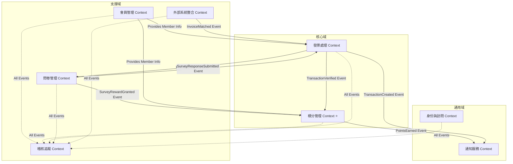

# 上下文映射圖 (Context Map)

> **版本**: 1.0
> **最後更新**: 2025-01-08

---

## **4.1 上下文關係概覽**



## **4.2 上下文關係詳細說明**

### **關係 1: 發票處理 → 積分管理** (事件驅動)
- **關係類型**: Customer-Supplier (客戶-供應商)
- **集成方式**: Domain Events (領域事件)
- **防腐層 (ACL)**: 積分管理訂閱 `TransactionVerified` 事件
- **數據流向**:
  - 發票處理發布 `TransactionVerified` 事件
  - 積分管理接收事件，計算並增加積分
  - 事件包含: MemberID, Amount, InvoiceDate, SurveySubmitted

### **關係 2: 問卷管理 → 積分管理** (事件驅動)
- **關係類型**: Customer-Supplier
- **集成方式**: Domain Events
- **數據流向**:
  - 問卷管理發布 `SurveyRewardGranted` 事件
  - 積分管理接收事件，增加問卷獎勵積分 (+1 點)

### **關係 3: 外部系統整合 → 發票處理** (事件驅動)
- **關係類型**: Customer-Supplier
- **集成方式**: Domain Events + Shared Kernel (共享發票識別碼)
- **數據流向**:
  - 外部系統整合發布 `InvoiceMatched` 事件
  - 發票處理接收事件，驗證交易狀態

### **關係 4: 會員管理 → 積分管理 / 發票處理** (共享內核)
- **關係類型**: Shared Kernel (共享 MemberID)
- **集成方式**: 共享 MemberID 值對象
- **說明**: MemberID 是跨上下文的共享概念，所有上下文都使用相同的 MemberID 格式

### **關係 5: 發票處理 ⇄ 問卷管理** (雙向關聯)
- **關係類型**: Partnership (夥伴關係)
- **集成方式**:
  - 發票處理創建交易時生成問卷連結
  - 問卷管理提交回應時更新交易的 `SurveySubmitted` 狀態
- **防腐層**:
  - 發票處理: `SurveyLinkGenerator` (生成問卷連結)
  - 問卷管理: `TransactionUpdater` (更新交易狀態)

### **關係 6: 積分管理 / 發票處理 → 通知服務** (事件驅動)
- **關係類型**: Conformist (遵奉者)
- **集成方式**: Domain Events
- **說明**: 通知服務被動接收事件，無反饋

### **關係 7: 所有業務上下文 → 稽核追蹤** (事件驅動 + 事務一致性)
- **關係類型**: Conformist (遵奉者) + Transactional Consistency (事務一致性)
- **集成方式**:
  - **方式 1 (推薦)**: Transactional Outbox Pattern (事務性發件箱模式)
  - **方式 2**: Direct Synchronous Recording (同步直接記錄)
- **數據流向**:
  - 所有業務上下文發布領域事件 → 稽核上下文監聽並記錄
  - 稽核上下文監聽的事件類型：
    - 會員管理: `MemberRegistered`, `PhoneNumberBound`, `MemberDeleted`
    - 積分管理: `PointsEarned`, `PointsDeducted`, `PointsRecalculated`
    - 發票處理: `TransactionCreated`, `TransactionVerified`, `TransactionFailed`
    - 問卷管理: `SurveyCreated`, `SurveyActivated`, `SurveyResponseSubmitted`
    - 外部系統: `ImportBatchCompleted`, `InvoiceMatched`
    - 身份訪問: `AdminLogin`, `AdminRoleChanged`
- **事務一致性保證**:
  ```go
  // 業務操作與稽核日誌必須在同一事務中
  txManager.InTransaction(func(ctx Context) error {
      // 1. 執行業務操作
      account.EarnPoints(amount, source, sourceID, description)
      accountRepo.Update(ctx, account)

      // 2. 記錄稽核日誌（同一事務）
      auditLog := NewAuditLog(
          eventType: POINTS_EARNED,
          actor: Actor{Type: MEMBER, ID: memberID},
          target: Target{Type: POINTS_ACCOUNT, ID: accountID},
          action: UPDATE,
          changes: Changes{Before: oldPoints, After: newPoints},
      )
      auditRepo.Create(ctx, auditLog) // 如果失敗，整個事務回滾

      return nil // 兩者一同提交
  })
  ```
- **設計原則**:
  - ✅ **單向依賴**: 稽核上下文只監聽事件，不發布事件（避免循環依賴）
  - ✅ **不可變記錄**: 稽核日誌一旦創建，永不修改或刪除
  - ✅ **原子性保證**: 業務操作成功 ⟺ 稽核日誌成功（同一事務）
  - ✅ **敏感資料保護**: IP 位址、手機號碼部分遮罩
  - ✅ **分層保存**: 熱資料（1年）/ 溫資料（1-3年）/ 冷資料（3年+）
- **防腐層**: 不需要（稽核上下文完全被動，遵循所有業務上下文的模型）

---

## **4.3 一致性邊界與補償策略**

**設計原則**: 明確區分強一致性（同步事務）與最終一致性（異步事件），並為失敗場景提供補償機制

### **強一致性邊界（單一事務）**

這些操作必須在同一資料庫事務中完成，確保原子性：

#### **1. 會員註冊流程**
```
TransactionBoundary: Member Context + Points Context
流程:
  1. 創建 Member 實體
  2. 創建 PointsAccount 實體（初始積分 = 0）
  3. 兩者在同一事務中提交

失敗處理:
  - 任何步驟失敗 → 整個事務回滾
  - 不需要補償（ACID 保證）
```

#### **2. 積分重算流程**
```
TransactionBoundary: Points Context (單一上下文)
流程:
  1. 鎖定所有 PointsAccount（SELECT FOR UPDATE）
  2. 對每個帳戶重新計算積分
  3. 批次更新所有帳戶
  4. 整體提交或回滾

失敗處理:
  - 任何錯誤 → 整個事務回滾
  - 執行時機：離峰時段（凌晨 3:00-5:00）
  - 超時設定：最多 5 分鐘
```

#### **3. 稽核日誌記錄流程**
```
TransactionBoundary: 任何業務 Context + Audit Context
流程:
  1. 開啟資料庫事務
  2. 執行業務操作（如 UpdateMember, EarnPoints, VerifyTransaction）
  3. 創建稽核日誌（在同一事務中）
  4. 兩者一同提交或回滾

事務保證:
  ✅ 業務操作成功 ⟺ 稽核日誌成功（原子性）
  ❌ 業務操作成功 但 稽核日誌失敗 → 不允許（事務回滾）
  ❌ 業務操作失敗 但 稽核日誌成功 → 不允許（事務回滾）

失敗處理:
  - 稽核日誌寫入失敗 → 整個事務回滾（業務操作也取消）
  - 保證 100% 稽核完整性（無漏記、無孤立業務操作）
  - 性能開銷：< 50ms（稽核日誌寫入額外時間）
```

**實現範例**:
```go
// Application Layer - EarnPointsUseCase
func (uc *EarnPointsUseCase) Execute(cmd EarnPointsCommand) error {
    return uc.txManager.InTransaction(func(ctx Context) error {
        // 1. 業務操作
        account, _ := uc.accountRepo.FindByMemberID(ctx, cmd.MemberID)
        oldPoints := account.EarnedPoints()
        account.EarnPoints(cmd.Amount, cmd.Source, cmd.SourceID, cmd.Description)
        uc.accountRepo.Update(ctx, account)

        // 2. 稽核日誌（同一事務）
        auditLog := domain.NewAuditLog(
            domain.POINTS_EARNED,
            domain.Actor{Type: domain.MEMBER, ID: cmd.MemberID},
            domain.Target{Type: domain.POINTS_ACCOUNT, ID: account.ID()},
            domain.UPDATE,
            domain.Changes{
                Before: map[string]interface{}{"earned_points": oldPoints},
                After:  map[string]interface{}{"earned_points": account.EarnedPoints()},
            },
            domain.Metadata{Reason: cmd.Description},
        )
        uc.auditRepo.Create(ctx, auditLog) // 失敗 → 事務回滾

        return nil // 同時提交
    })
}
```

---

### **最終一致性邊界（事件驅動）**

這些操作跨越上下文邊界，使用異步事件，接受最終一致性：

#### **1. 交易驗證 → 積分計算**

**數據流向**:
```
Invoice Context                    Points Context
      │                                 │
      │ 1. TransactionVerified 事件     │
      ├─────────────────────────────────>
      │                                 │
      │                        2. EarnPoints()
      │                                 │
      │ 3. PointsEarned 事件 (optional) │
      <─────────────────────────────────┤
```

**一致性保證**:
- ✅ **冪等性**: 使用 Event ID 去重（Redis + 24小時 TTL）
  ```go
  func (h *TransactionVerifiedHandler) Handle(event TransactionVerified) error {
      // 冪等性檢查
      if h.cache.Exists(event.EventID) {
          return nil // 已處理過，跳過
      }

      // 執行業務邏輯
      h.pointsService.EarnPoints(...)

      // 標記已處理
      h.cache.Set(event.EventID, true, 24*time.Hour)
      return nil
  }
  ```

- ✅ **重試機制**: 指數退避（1秒、2秒、4秒，最多 3 次）
  ```go
  RetryPolicy:
    MaxRetries: 3
    InitialDelay: 1s
    MaxDelay: 10s
    Multiplier: 2.0
  ```

**失敗處理**:
1. **事件處理失敗**:
   - 記錄錯誤日誌（包含 EventID, TransactionID, Error）
   - 發送告警給管理員
   - 3 次重試後進入 Dead Letter Queue

2. **補償策略**:
   - **手動補償**: 管理員執行「積分重算」CLI 指令
   ```bash
   make recalculate-points
   # 或指定單一會員
   ./cli recalculate --member-id=12345
   ```
   - **自動補償**: 每日凌晨自動重算所有積分（可選）

---

#### **2. 問卷提交 → 交易更新 → 積分獎勵**

**數據流向**:
```
Survey Context         Invoice Context         Points Context
      │                      │                       │
      │ 1. SubmitSurvey      │                       │
      │ SurveyResponseSubmitted 事件                  │
      ├──────────────────────>                       │
      │                      │                       │
      │              2. UpdateTransaction            │
      │              (SurveySubmitted=true)          │
      │                      │                       │
      │                      │ 3. TransactionUpdated 事件
      │                      ├───────────────────────>
      │                      │              4. EarnPoints(+1)
```

**一致性保證**:
- ✅ **唯一性約束**: 資料庫層面保證同一 TransactionID 只能有一個 SurveyResponse
  ```sql
  CREATE UNIQUE INDEX idx_survey_response_transaction
  ON survey_responses(transaction_id);
  ```

- ✅ **冪等性**: 積分獎勵在交易驗證時檢查 `SurveySubmitted` 狀態
  ```go
  func (s *PointsCalculationService) CalculateSurveyBonus(tx Transaction) int {
      if tx.SurveySubmitted && !tx.SurveyBonusGranted {
          return 1
      }
      return 0
  }
  ```

**失敗場景與補償**:

| 失敗點 | 現象 | 補償策略 |
|--------|------|----------|
| **問卷提交成功，但交易更新失敗** | SurveyResponse 已存在，但 Transaction.SurveySubmitted=false | 事件重試（3次）<br>失敗後：積分重算時自動修正 |
| **交易更新成功，但積分獎勵失敗** | Transaction.SurveySubmitted=true，但未獲得 +1 點 | 事件重試（3次）<br>失敗後：積分重算時自動補發 |
| **事件丟失（消息隊列故障）** | SurveyResponse 已提交，但無任何後續處理 | 定時任務（每小時）：<br>查詢已提交但未處理的問卷，重新發布事件 |

---

#### **3. iChef 批次匯入 → 發票驗證**

**數據流向**:
```
Integration Context              Invoice Context
       │                               │
       │ 1. ImportBatch (Excel上傳)    │
       │                               │
       │ 2. InvoiceMatched 事件（批次） │
       ├───────────────────────────────>
       │                               │
       │                    3. VerifyTransaction() (逐筆)
       │                               │
       │ 4. ImportStatistics 計算結果  │
       <───────────────────────────────┤
```

**一致性保證**:
- ✅ **批次處理事務隔離**: 每個批次在獨立事務中處理
- ✅ **重複檢測**: 相同發票（號碼+日期+金額）只能匯入一次
  ```sql
  CREATE UNIQUE INDEX idx_imported_invoice_unique
  ON imported_invoice_records(invoice_number, invoice_date, amount);
  ```

**失敗處理**:
1. **部分發票匹配失敗**:
   - ✅ 已匹配的發票狀態 = `Matched`，觸發驗證
   - ⚠️ 未匹配的發票狀態 = `Unmatched`，記錄日誌
   - 📊 統計摘要：`MatchedCount=85, UnmatchedCount=15`

2. **整個批次處理失敗**:
   - ❌ ImportBatch.Status = `Failed`
   - 💾 保留原始 Excel 文件
   - 🔁 管理員可重新上傳同一批次

---

### **一致性邊界總結**

| 操作 | 一致性模型 | 事務邊界 | 失敗補償 |
|------|-----------|---------|---------|
| **會員註冊** | 強一致性 | Member + Points | ACID 回滾 |
| **積分重算** | 強一致性 | Points Context | ACID 回滾 |
| **稽核日誌記錄** | **強一致性** | **業務 Context + Audit Context** | **ACID 回滾（業務 + 稽核同時失敗）** |
| **交易驗證→積分計算** | 最終一致性 | 跨 Context | 事件重試 + 手動重算 |
| **問卷提交→獎勵** | 最終一致性 | 跨 Context | 事件重試 + 冪等處理 |
| **iChef 匯入** | 最終一致性 | 批次隔離 | 記錄統計 + 重新上傳 |

**重要設計決策**:
- ✅ **稽核日誌採用強一致性**: 確保 100% 記錄完整性，符合合規要求
- ✅ **所有業務操作都包含稽核記錄**: 無一例外，不允許孤立的業務操作
- ✅ **性能可接受**: < 50ms 額外開銷，不影響用戶體驗
- ⚠️ **不使用異步事件記錄稽核**: 避免稽核日誌丟失風險（不符合合規要求）

---

### **監控與告警**

#### **監控指標**:
1. **事件處理延遲**: 事件發布 → 處理完成的時間
   - ⚠️ 告警閾值：> 30 秒
2. **事件重試率**: 失敗重試的事件百分比
   - ⚠️ 告警閾值：> 5%
3. **Dead Letter Queue 大小**: 最終失敗的事件數量
   - ⚠️ 告警閾值：> 10 個事件
4. **積分不一致檢測**: 定期比對 Transaction 與 Points 數據
   - 📅 執行頻率：每日凌晨 4:00

#### **補償工具**:
```bash
# 1. 手動重新處理失敗事件
./cli replay-events --from-dlq --event-type=TransactionVerified

# 2. 重算單一會員積分
./cli recalculate-points --member-id=12345

# 3. 全量積分重算（維護窗口）
./cli recalculate-points --all --confirm

# 4. 一致性檢查報告
./cli consistency-check --report=points-vs-transactions
```

---

**設計哲學**:
> **"Make the implicit explicit"** - 不要讓一致性策略隱藏在序列圖中，必須明確文檔化並提供自動化補償工具。
