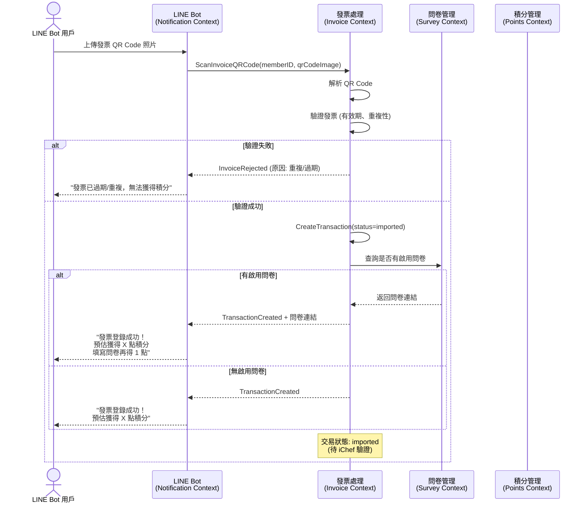
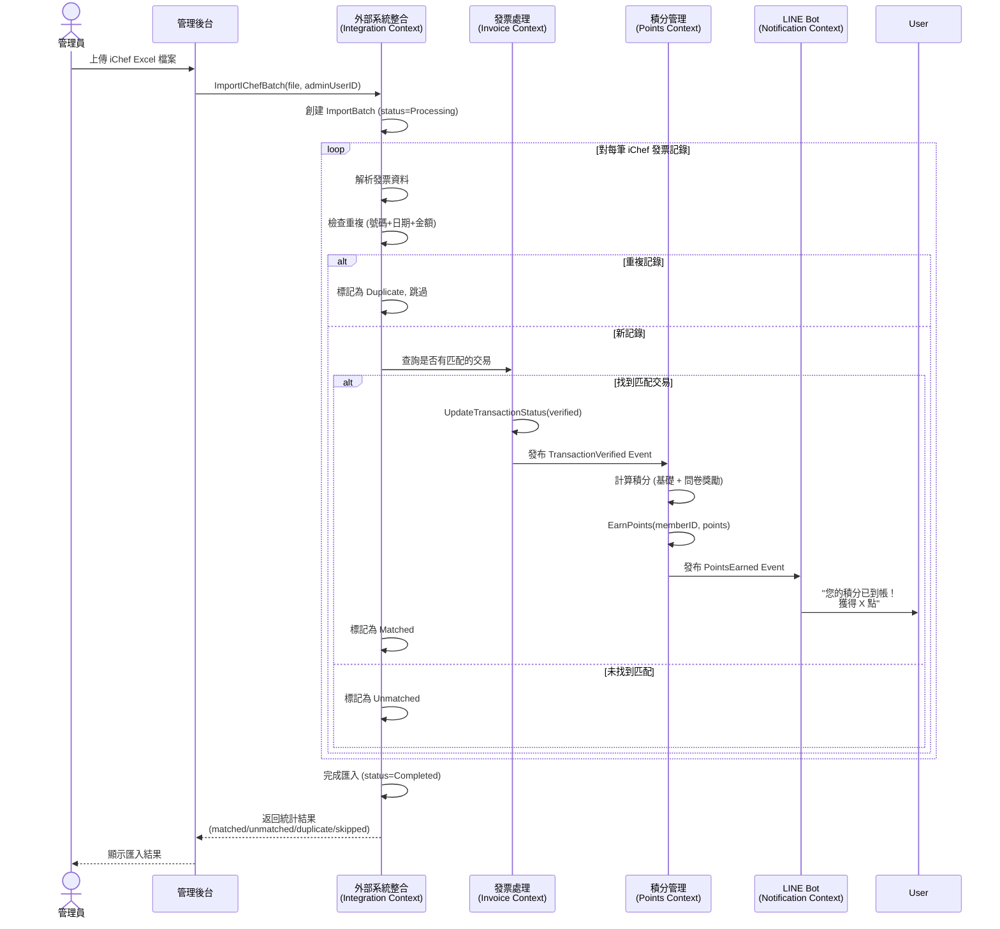
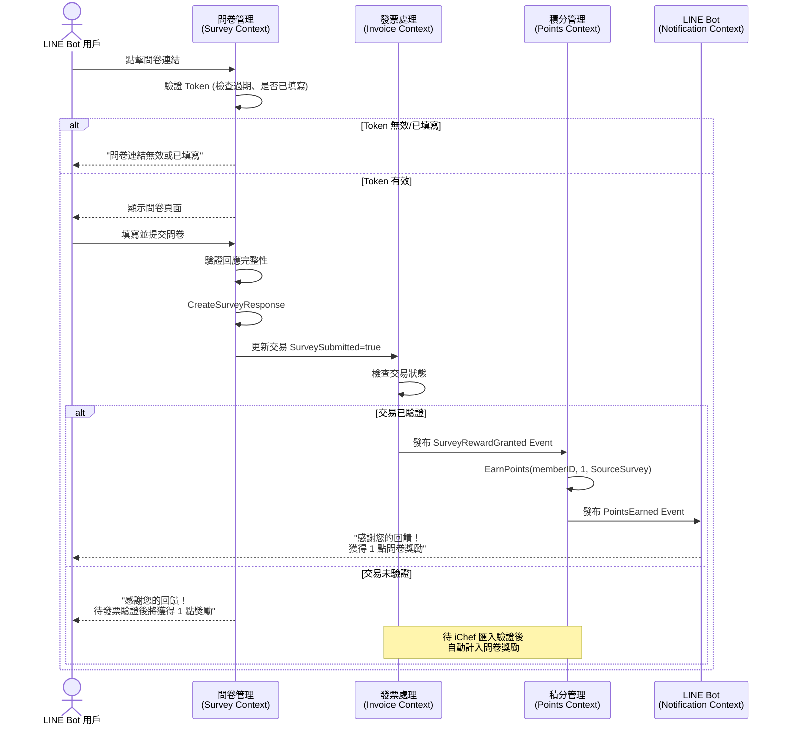
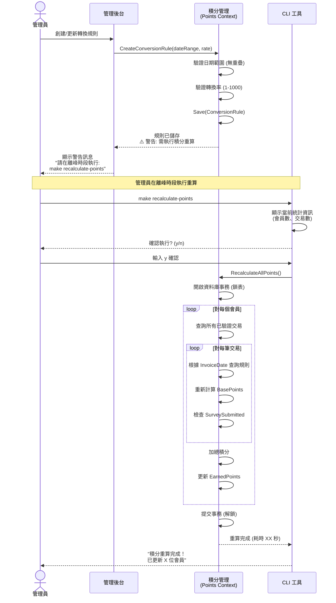

# 關鍵業務流程

> **版本**: 1.0
> **最後更新**: 2025-01-08

---

## **6.1 業務流程 1: QR Code 掃描與積分獲得**

```mermaid
sequenceDiagram
    actor User as LINE Bot 用戶
    participant LB as LINE Bot<br/>(Notification Context)
    participant INV as 發票處理<br/>(Invoice Context)
    participant SV as 問卷管理<br/>(Survey Context)
    participant PT as 積分管理<br/>(Points Context)

    User->>LB: 上傳發票 QR Code 照片
    LB->>INV: ScanInvoiceQRCode(memberID, qrCodeImage)

    INV->>INV: 解析 QR Code
    INV->>INV: 驗證發票 (有效期、重複性)

    alt 驗證失敗
        INV-->>LB: InvoiceRejected (原因: 重複/過期)
        LB-->>User: "發票已過期/重複，無法獲得積分"
    else 驗證成功
        INV->>INV: CreateTransaction(status=imported)
        INV->>SV: 查詢是否有啟用問卷

        alt 有啟用問卷
            SV-->>INV: 返回問卷連結
            INV-->>LB: TransactionCreated + 問卷連結
            LB-->>User: "發票登錄成功！<br/>預估獲得 X 點積分<br/>填寫問卷再得 1 點"
        else 無啟用問卷
            INV-->>LB: TransactionCreated
            LB-->>User: "發票登錄成功！<br/>預估獲得 X 點積分"
        end

        Note over INV: 交易狀態: imported<br/>(待 iChef 驗證)
    end
```

## **6.2 業務流程 2: iChef 批次匯入與交易驗證**

```mermaid
sequenceDiagram
    actor Admin as 管理員
    participant UI as 管理後台
    participant INT as 外部系統整合<br/>(Integration Context)
    participant INV as 發票處理<br/>(Invoice Context)
    participant PT as 積分管理<br/>(Points Context)
    participant LB as LINE Bot<br/>(Notification Context)

    Admin->>UI: 上傳 iChef Excel 檔案
    UI->>INT: ImportIChefBatch(file, adminUserID)

    INT->>INT: 創建 ImportBatch (status=Processing)

    loop 對每筆 iChef 發票記錄
        INT->>INT: 解析發票資料
        INT->>INT: 檢查重複 (號碼+日期+金額)

        alt 重複記錄
            INT->>INT: 標記為 Duplicate, 跳過
        else 新記錄
            INT->>INV: 查詢是否有匹配的交易

            alt 找到匹配交易
                INV->>INV: UpdateTransactionStatus(verified)
                INV->>PT: 發布 TransactionVerified Event

                PT->>PT: 計算積分 (基礎 + 問卷獎勵)
                PT->>PT: EarnPoints(memberID, points)

                PT->>LB: 發布 PointsEarned Event
                LB->>User: "您的積分已到帳！<br/>獲得 X 點"

                INT->>INT: 標記為 Matched
            else 未找到匹配
                INT->>INT: 標記為 Unmatched
            end
        end
    end

    INT->>INT: 完成匯入 (status=Completed)
    INT-->>UI: 返回統計結果<br/>(matched/unmatched/duplicate/skipped)
    UI-->>Admin: 顯示匯入結果
```

## **6.3 業務流程 3: 問卷填寫與獎勵發放**

```mermaid
sequenceDiagram
    actor User as LINE Bot 用戶
    participant SV as 問卷管理<br/>(Survey Context)
    participant INV as 發票處理<br/>(Invoice Context)
    participant PT as 積分管理<br/>(Points Context)
    participant LB as LINE Bot<br/>(Notification Context)

    User->>SV: 點擊問卷連結
    SV->>SV: 驗證 Token (檢查過期、是否已填寫)

    alt Token 無效/已填寫
        SV-->>User: "問卷連結無效或已填寫"
    else Token 有效
        SV-->>User: 顯示問卷頁面
        User->>SV: 填寫並提交問卷

        SV->>SV: 驗證回應完整性
        SV->>SV: CreateSurveyResponse
        SV->>INV: 更新交易 SurveySubmitted=true

        INV->>INV: 檢查交易狀態

        alt 交易已驗證
            INV->>PT: 發布 SurveyRewardGranted Event
            PT->>PT: EarnPoints(memberID, 1, SourceSurvey)
            PT->>LB: 發布 PointsEarned Event
            LB-->>User: "感謝您的回饋！<br/>獲得 1 點問卷獎勵"
        else 交易未驗證
            SV-->>User: "感謝您的回饋！<br/>待發票驗證後將獲得 1 點獎勵"
            Note over INV,PT: 待 iChef 匯入驗證後<br/>自動計入問卷獎勵
        end
    end
```

## **6.4 業務流程 4: 積分規則變更與重算**

```mermaid
sequenceDiagram
    actor Admin as 管理員
    participant UI as 管理後台
    participant PT as 積分管理<br/>(Points Context)
    participant CLI as CLI 工具

    Admin->>UI: 創建/更新轉換規則
    UI->>PT: CreateConversionRule(dateRange, rate)

    PT->>PT: 驗證日期範圍 (無重疊)
    PT->>PT: 驗證轉換率 (1-1000)
    PT->>PT: Save(ConversionRule)

    PT-->>UI: 規則已儲存<br/>⚠️ 警告: 需執行積分重算
    UI-->>Admin: 顯示警告訊息<br/>"請在離峰時段執行:<br/>make recalculate-points"

    Note over Admin,CLI: 管理員在離峰時段執行重算

    Admin->>CLI: make recalculate-points
    CLI->>CLI: 顯示當前統計資訊<br/>(會員數、交易數)
    CLI-->>Admin: 確認執行? (y/n)
    Admin->>CLI: 輸入 y 確認

    CLI->>PT: RecalculateAllPoints()

    PT->>PT: 開啟資料庫事務 (鎖表)

    loop 對每個會員
        PT->>PT: 查詢所有已驗證交易

        loop 對每筆交易
            PT->>PT: 根據 InvoiceDate 查詢規則
            PT->>PT: 重新計算 BasePoints
            PT->>PT: 檢查 SurveySubmitted
        end

        PT->>PT: 加總積分
        PT->>PT: 更新 EarnedPoints
    end

    PT->>PT: 提交事務 (解鎖)
    PT-->>CLI: 重算完成 (耗時 XX 秒)
    CLI-->>Admin: "積分重算完成！<br/>已更新 X 位會員"
```
